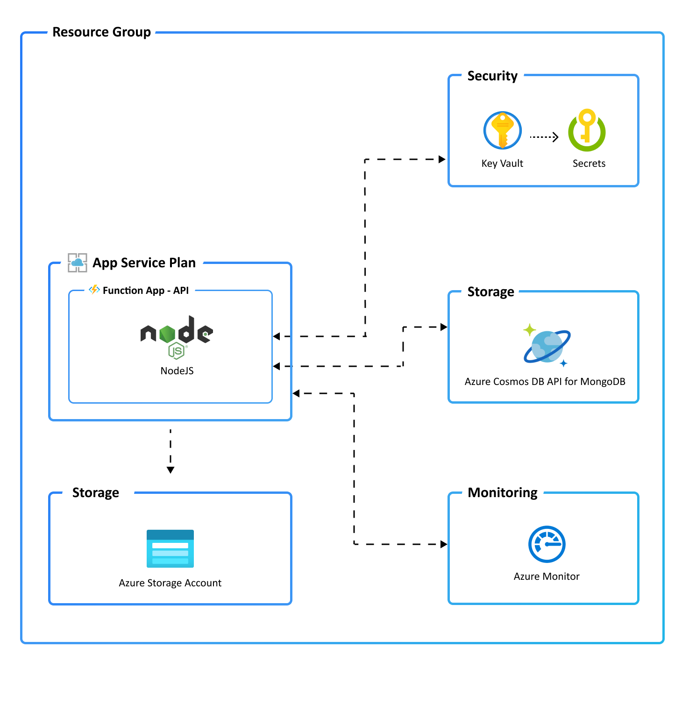

# Contoso Real Estate Application

### Projects

| Project | Location                               | Description | Branch | Build Status |
| ------- | -------------------------------------- | ----------- | ------ | ------------ |
| Portal  | [packages/portal](./packages/portal)   |             | TODO   | TODO         |
| API     | [packages/api](./packages/api)         |             | TODO   | TODO         |
| Blog    | [packages/blog](./packages/blog)       |             | TODO   | TODO         |
| Testing | [packages/testing](./packages/testing) |             | TODO   | TODO         |

### Prerequisites

The following prerequisites are required to use this application. Please ensure that you have them all installed locally.

- [Azure Developer CLI](https://aka.ms/azure-dev/install)
  - Windows:
    ```powershell
    powershell -ex AllSigned -c "Invoke-RestMethod 'https://aka.ms/install-azd.ps1' | Invoke-Expression"
    ```
  - Linux/MacOS:
    ```
    curl -fsSL https://aka.ms/install-azd.sh | bash
    ```
- [Azure CLI (2.38.0+)](https://docs.microsoft.com/cli/azure/install-azure-cli)
- [Azure functions core tools (4+)](https://docs.microsoft.com/azure/azure-functions/functions-run-local#v4)
- [Node.js 16+ with npm 8+](https://nodejs.org/) - for API backend and Web frontend
  - If you need to update npm, once Node.js is installed, run `npm install -g npm@latest`
- [Git (2.36.1+)](https://git-scm.com/)

### Quickstart

The fastest way for you to get this application up and running on Azure is to use the `azd up` command. This single command will create and configure all necessary Azure resources - including access policies and roles for your account and service-to-service communication with Managed Identities.

1. Open a terminal, change into to this project root folder.
2. Run the following command to initialize the project, provision Azure resources, and deploy the application code.

```bash
azd up
```

3. Install all necessary dependencies for all packages:

```bash
npm install
```

Note that when running `azd up` you will be prompted for the following information:

- `Environment Name`: This will be used as a prefix for the resource group that will be created to hold all Azure resources. This name should be unique within your Azure subscription.
- `Azure Location`: The Azure location where your resources will be deployed.
- `Azure Subscription`: The Azure Subscription where your resources will be deployed.

> NOTE: This API may only be used used with following Azure locations:
>
> - Central US
> - East Asia
> - East US 2
> - West Europe
> - West US 2
>
> If you attempt to use the project with an unsupported region, the provision step will fail.

> NOTE: This may take a while to complete as it executes three commands: `azd init` (initializes environment), `azd provision` (provisions Azure resources), and `azd deploy` (deploys application code). You will see a progress indicator as it provisions and deploys your application.

When `azd up` is complete it will output the following URLs:

- Azure Portal link to view resources
- API link for Azure Functions

> NOTE:
>
> - The `azd up` command will create Azure resources that will incur costs to your Azure subscription. You can clean up those resources manually via the Azure portal or with the `azd down` command.
> - You can call `azd up` as many times as you like to both provision and deploy your solution.

### Application Architecture

This application utilizes the following Azure resources:

- [**Azure Function Apps**](https://docs.microsoft.com/azure/azure-functions/) to host the Serverless API backend
- [**Azure App Service**](https://docs.microsoft.com/azure/app-service/) needed to deploy Azure Functions
- [**Azure Cosmos DB API for MongoDB**](https://docs.microsoft.com/azure/cosmos-db/mongodb/mongodb-introduction) for database
- [**Azure Monitor**](https://docs.microsoft.com/azure/azure-monitor/) for monitoring and logging
- [**Azure Key Vault**](https://docs.microsoft.com/azure/key-vault/) for securing secrets
- [**Azure Storage**](https://docs.microsoft.com/azure/storage/) for storing blobs (also needed by Azure Functions)

Here's a high level architecture diagram that illustrates these components. Notice that these are all contained within a single [resource group](https://docs.microsoft.com/azure/azure-resource-manager/management/manage-resource-groups-portal), that will be created for you when you create the resources.



> This project provisions resources to an Azure subscription that you will select upon provisioning them. Please refer to the [Pricing calculator for Microsoft Azure](https://azure.microsoft.com/pricing/calculator/) and, if needed, update the included Azure resource definitions found in `infra/main.bicep` to suit your needs.

### Application Code

The repo is structured to follow the [npm workspaces](https://docs.npmjs.com/cli/v8/using-npm/workspaces) conventions including:

- **Source Code**: All projects source code is located in the `packages/*` folder.

The repo is also structured to follow the [Azure Developer CLI](https://aka.ms/azure-dev) conventions including:

- **Infrastructure as Code**: All application "infrastructure as code" files are located in the `infra` folder.
- **Azure Developer Configuration**: An `azure.yaml` file located in the root that ties the application source code to the Azure services defined in your "infrastructure as code" files.
- **GitHub Actions**: A sample GitHub action file is located in the `.github/workflows` folder.
- **VS Code Configuration**: All VS Code configuration to run and debug the application is located in the `.vscode` folder.

### Azure Subscription

This project will create infrastructure and deploy code to Azure. If you don't have an Azure Subscription, you can sign up for a [free account here](https://azure.microsoft.com/free/).

### Azure Developer CLI - VS Code Extension

The Azure Developer experience includes an Azure Developer CLI VS Code Extension that mirrors all of the Azure Developer CLI commands into the `azure.yaml` context menu and command palette options. If you are a VS Code user, then we highly recommend installing this extension for the best experience.

Here's how to install it:

#### VS Code

1. Click on the "Extensions" tab in VS Code
1. Search for "Azure Developer CLI" - authored by Microsoft
1. Click "Install"

#### Marketplace

1. Go to the [Azure Developer CLI - VS Code Extension](https://marketplace.visualstudio.com/items?itemName=ms-azuretools.azure-dev) page
1. Click "Install"

Once the extension is installed, you can press `F1`, and type "Azure Developer CLI" to see all of your available options. You can also right click on your project's `azure.yaml` file for a list of commands.

### Next Steps

At this point, you have a complete application deployed on Azure. But there is much more that the Azure Developer CLI can do. These next steps will introduce you to additional commands that will make creating applications on Azure much easier. Using the Azure Developer CLI, you can setup your pipelines, monitor your application, test and debug locally.

#### Set up a pipeline using `azd pipeline`

This project includes a GitHub Actions pipeline configuration file that will deploy your application whenever code is pushed to the main branch. You can find that pipeline file here: `.github/workflows`.

Setting up this pipeline requires you to give GitHub permission to deploy to Azure on your behalf, which is done via a Service Principal stored in a GitHub secret named `AZURE_CREDENTIALS`. The `azd pipeline config` command will automatically create a service principal for you. The command also helps to create a private GitHub repository and pushes code to the newly created repo.

Before you call the `azd pipeline config` command, you'll need to install the following:

- [GitHub CLI (2.3+)](https://github.com/cli/cli)

Run the following command to set up a GitHub Action:

```bash
azd pipeline config
```

> Support for Azure DevOps Pipelines is coming soon to `azd pipeline config`. In the meantime, you can follow the instructions found here: [.azdo/pipelines/README.md](./.azdo/pipelines/README.md) to set it up manually.

#### Monitor the application using `azd monitor`

To help with monitoring applications, the Azure Dev CLI provides a `monitor` command to help you get to the various Application Insights dashboards.

- Run the following command to open the "Overview" dashboard:

  ```bash
  azd monitor --overview
  ```

- Live Metrics Dashboard

  Run the following command to open the "Live Metrics" dashboard:

  ```bash
  azd monitor --live
  ```

- Logs Dashboard

  Run the following command to open the "Logs" dashboard:

  ```bash
  azd monitor --logs
  ```

#### Run and Debug Locally

The easiest way to run and debug is to leverage the Azure Developer CLI Visual Studio Code Extension. Refer to this [walk-through](https://aka.ms/azure-dev/vscode) for more details.

#### Clean up resources

When you are done, you can delete all the Azure resources created with this template by running the following command:

```bash
azd down
```

### Additional azd commands

The Azure Developer CLI includes many other commands to help with your Azure development experience. You can view these commands at the terminal by running `azd help`. You can also view the full list of commands on our [Azure Developer CLI command](https://aka.ms/azure-dev/ref) page.

## Troubleshooting/Known issues

- Deploying an Azure Function App using `azd` triggers by default a remote build. And because each package is deployed independently, we can't share the same base tsconfig.base.json. As a temporary workaround, we need to duplicate the tsconfig.json configuration in each package.

## Security

### Roles

This template creates a [managed identity](https://docs.microsoft.com/azure/active-directory/managed-identities-azure-resources/overview) for your app inside your Azure Active Directory tenant, and it is used to authenticate your app with Azure and other services that support Azure AD authentication like Key Vault via access policies. You will see principalId referenced in the infrastructure as code files, that refers to the id of the currently logged in Azure CLI user, which will be granted access policies and permissions to run the application locally. To view your managed identity in the Azure Portal, follow these [steps](https://docs.microsoft.com/azure/active-directory/managed-identities-azure-resources/how-to-view-managed-identity-service-principal-portal).

### Key Vault

This template provides an optional [Azure Key Vault](https://docs.microsoft.com/azure/key-vault/general/overview) to securely store your Cosmos DB connection string for the provisioned Cosmos DB account. Key Vault is a cloud service for securely storing and accessing secrets (API keys, passwords, certificates, cryptographic keys) and makes it simple to give other Azure services access to them. As you continue developing your solution, you may add as many secrets to your Key Vault as you require.

## Reporting Issues and Feedback

### The Azure Dev CLI

If you have any feature requests, issues, or areas for improvement, please [file an issue](https://aka.ms/azure-dev/issues). To keep up-to-date, ask questions, or share suggestions, join our [GitHub Discussions](https://aka.ms/azure-dev/discussions). You may also contact us via AzDevTeam@microsoft.com.

### The SWA CLI

If you have any feature requests, issues, or areas for improvement, please [file an issue](https://github.com/Azure/static-web-apps-cli/issues). To keep up-to-date, ask questions, or share suggestions, join our [GitHub Discussions](https://github.com/Azure/static-web-apps/discussions).
