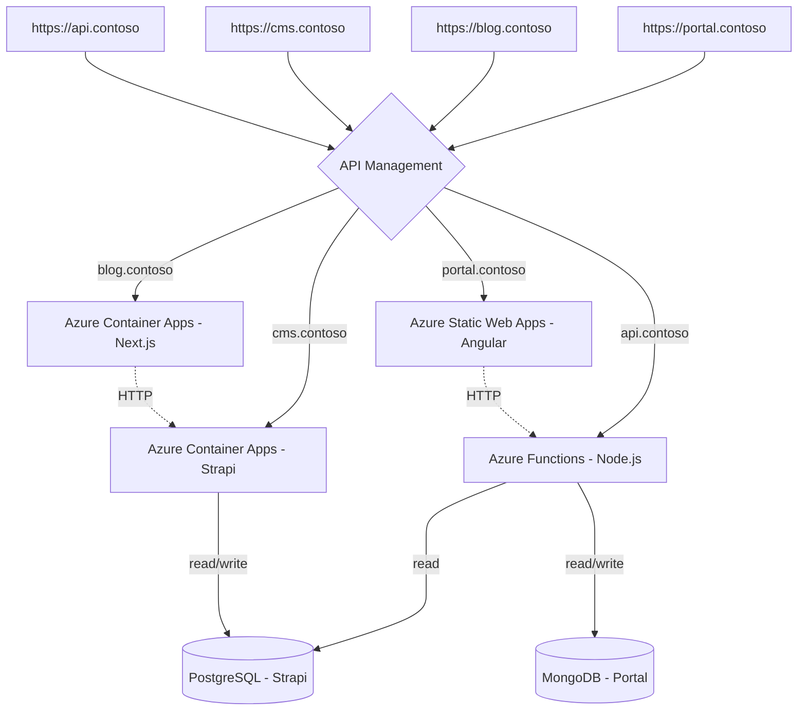

# JavaScript Entreprise-grade Reference Architecture

This repository contains the reference architecture and components for building an entreprise-grade moderne microfrontends application. It is a collection of best practices, architure patterns, and components that can be used to build and deploy modern JavaScript microfrontends applications to Azure.


## Table of Contents

You can navigate through the documentation using the table of contents below:

- [Architecture Diagram](#architecture-diagram)
- [Components](#components)
  - [Frontend](#frontend)
  - [Backend](#backend)
  - [DevOps](#devops)
  - [Developer tools](#developer-tools)
- [Getting Started](#getting-started)
- [Deploy to Azure](#deploy-to-azure)
  - [Preqrequisites](#preqrequisites)
  - [Deploy to Azure](#deploy-to-azure-1)


## Architecture Diagram

<p align="center">
  
</p>

## Simplified Sequence Diagram



## Components

### Frontend

- [Angular](https://angular.io/) - The Portal application used to view and book listings.
- [Next.js](https://nextjs.org/) - The Blog application used to view and create blog posts.
- [Playwright](https://playwright.dev/) - The end-to-end testing of the Portal application.
- [Azure Static Web Apps](https://azure.microsoft.com/services/app-service/static/) - The hosting of the Portal application.

### Backend

- [Strapi](https://strapi.io/) - The CMS application used to manage the data for the Portal and Blog applications.
- [Stripe](https://stripe.com/) - The payment processing.
- [Fastify](https://www.fastify.io/) - The API used that interfaces with the Stripe API and Portal application.
- [Azure Functions](https://azure.microsoft.com/services/functions/) - The API used to communicate with Portal application.
- [MongoDB for Azure Cosmos DB](https://azure.microsoft.com/services/cosmos-db/) - The database used to store the data for the Portal application.
- [Azure Database for PostgreSQL](https://azure.microsoft.com/services/postgresql/) - The database used to store the data for the CMS application.
- [Azure Storage](https://azure.microsoft.com/services/storage/) - The storage used to store the data for the CMS and Blog application.
- [Azure Container Apps](https://azure.microsoft.com/services/container-apps/) - The hosting of the Blog, Stripe and Strapi APIs.
- [Azure Application Insights](https://azure.microsoft.com/services/monitor/) - Monitoring and accessing logs for the applications and APIs.

### DevOps

- [Azure CLI](https://learn.microsoft.com/cli/azure/install-azure-cli) - Provisioning, managing and deploying the application to Azure.
- [Azure Dev CLI](https://learn.microsoft.com/azure/developer/azure-developer-cli/install-azd) - Accelerating the process of building cloud apps on Azure.
- [GitHub Actions](https://github.com/features/actions) - The CI/CD pipelines.

### Developer tools

- [Visual Studio Code](https://code.visualstudio.com/) - The local IDE experience.
- [GitHub Codespaces](https://github.com/features/codespaces) - The cloud IDE experience.
- [Azure Static Web Apps CLI](https://azure.github.io/static-web-apps-cli/) - The local development experience.

## Getting Started

This project is optimized for use with [GitHub Codespaces](https://github.com/features/codespaces). Here is how to get started:

1. Fork this repository.
2. Create a new GitHub Codespace from your fork. This will automatically provision a new Codespace with all the required dependencies installed.
3. In the terminal, run `npm start` to start the development server.
4. Open the application in your browser by clicking on the `Open Browser` button in the bottom right corner of the Codespace.

For more informations about working with GitHub Codespaces, please visit the [GitHub Docs](https://docs.github.com/en/codespaces/developing-in-codespaces/opening-an-existing-codespace).

For more details about the project structure, please visit the [Project Structure](docs/project-structure.md) documentation.

## Deploy to Azure

This project uses [GitHub Codespaces](https://github.com/features/codespaces) as the main development environment. The following steps assume you are using GitHub Codespaces. If you are not using GitHub Codespaces, you can still deploy the application to Azure by following the steps in the [Deploy to Azure](docs/deploy-to-azure.md) documentation.

### Preqrequisites

This project uses Azure Dev CLI to provision, manage and deploy the application to Azure. Here is how to deploy the application to Azure:

1. Then run the following command to check you are running [Azure CLI](https://docs.microsoft.com/cli/azure/install-azure-cli) version 2.38.0 or later:

```bash
az --version
```

2. Check the Azure Bicep extension is installed by running the following command:

```bash
az bicep version
```

3. Next, [sign in to your Azure account](https://learn.microsoft.com/cli/azure/authenticate-azure-cli#sign-in-interactively) by running the following command:

```bash
az login
```

4. (Optional) Make sure you are using the correct subscription by running the following command:

```bash
az account show
az account set --subscription <subscription-id>
```

### Deploy to Azure

Runing the following command will get you started with the deployment. This command will create an `azd` developement environment, provision the Azure resources, and deploy the application to Azure.

```bash
azd up
```

Note: if asked 
