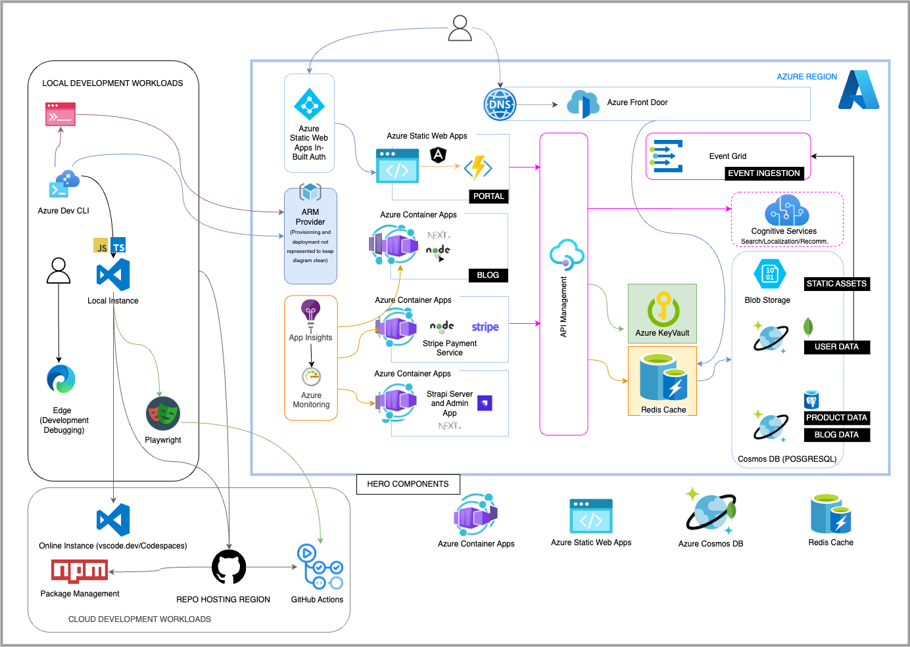
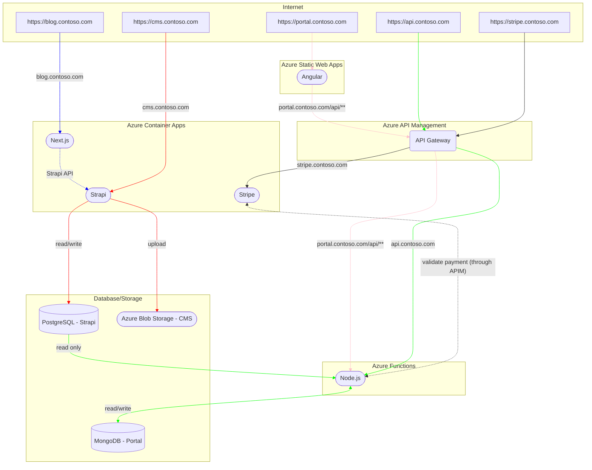
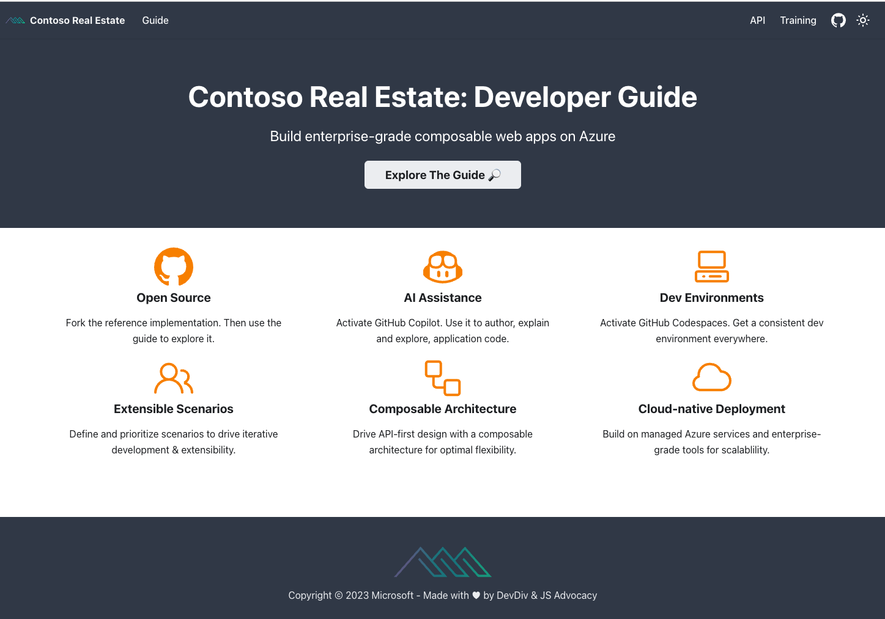
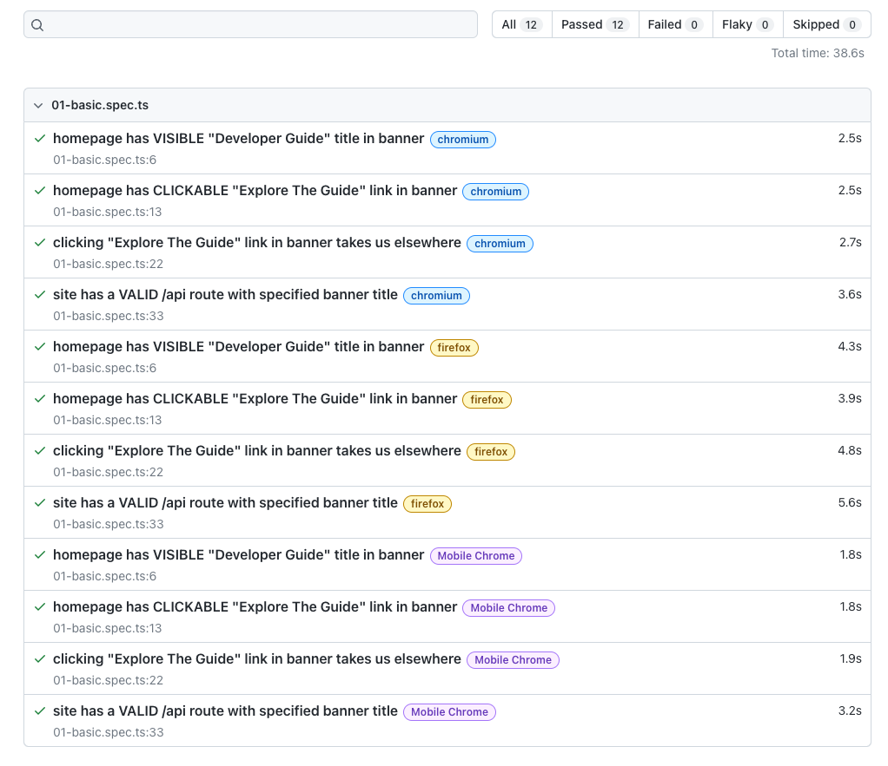

# Enterprise-grade Reference Architecture for JavaScript

This repository contains the reference architecture and components for building enterprise-grade modern composable frontends (or micro-frontends) and cloud-native applications. It is a collection of best practices, architecture patterns, and functional components that can be used to build and deploy modern JavaScript applications to Azure.


[](https://codespaces.new/Azure-Samples/contoso-real-estate?devcontainer_path=.devcontainer/devcontainer.json)

## Table of Contents

You can navigate through the documentation using the table of contents below:

- [Enterprise-grade Reference Architecture for JavaScript](#enterprise-grade-reference-architecture-for-javascript)
  - [Table of Contents](#table-of-contents)
  - [Architecture Diagram](#architecture-diagram)
  - [Simplified Flow Diagram](#simplified-flow-diagram)
  - [Components](#components)
    - [Frontend](#frontend)
    - [Backend](#backend)
    - [DevOps](#devops)
    - [Developer tools](#developer-tools)
  - [Development environment](#development-environment)
  - [Usage costs](#usage-costs)
  - [Project structure](#project-structure)
  - [Deploy to Azure](#deploy-to-azure)
    - [Prerequisites](#prerequisites)
    - [Deploy to Azure](#deploy-to-azure-1)
    - [Configure CI-CD](#configure-ci-cd)
    - [Clean up resources](#clean-up-resources)
  - [Want to help?](#want-to-help)

## Architecture Diagram

<p align="center">
  
</p>

## Simplified Flow Diagram



## Components

### Frontend

- [Angular](https://angular.io/) - The Portal application used to view and book listings.
- [Next.js](https://nextjs.org/) - The Blog application used to view and create blog posts.
- [Playwright](https://playwright.dev/) - The end-to-end testing of the Portal application.
- [Azure Static Web Apps](https://azure.microsoft.com/services/app-service/static/) - The hosting of the Portal application.

### Backend

- [Strapi](https://strapi.io/) - The CMS application used to manage the data for the Portal and Blog applications.
- [Stripe](https://stripe.com/) - The payment processing.
- [Fastify](https://www.fastify.io/) - The API used that interfaces with the Stripe API and Portal application.
- [Azure Functions](https://azure.microsoft.com/services/functions/) - The API used to communicate with Portal application.
- [MongoDB for Azure Cosmos DB](https://azure.microsoft.com/services/cosmos-db/) - The database used to store the data for the Portal application.
- [Azure Database for PostgreSQL](https://azure.microsoft.com/services/postgresql/) - The database used to store the data for the CMS application.
- [Azure Storage](https://azure.microsoft.com/services/storage/) - The storage used to store the data for the CMS and Blog application.
- [Azure Container Apps](https://azure.microsoft.com/services/container-apps/) - The hosting of the Blog, Stripe and Strapi APIs.
- [Azure Application Insights](https://azure.microsoft.com/services/monitor/) - Monitoring and accessing logs for the applications and APIs.

### DevOps

- [Azure CLI](https://learn.microsoft.com/cli/azure/install-azure-cli) - Provisioning, managing and deploying the application to Azure.
- [GitHub Actions](https://github.com/features/actions) - The CI/CD pipelines.
- [Azure Developer CLI](https://learn.microsoft.com/azure/developer/azure-developer-cli/overview) - The CI/CD pipelines.

### Developer tools

- [Visual Studio Code](https://code.visualstudio.com/) - The local IDE experience.
- [GitHub Codespaces](https://github.com/features/codespaces) - The cloud IDE experience.
- [Azure Static Web Apps CLI](https://azure.github.io/static-web-apps-cli/) - Accelerates the process of building cloud apps on Azure.

## Development environment

This project is optimized for use with [GitHub Codespaces](https://github.com/features/codespaces), a development environment hosted in the GitHub cloud. Here is how to get started:

1. Fork this repository.
1. Create a new GitHub Codespaces from your fork. This will automatically provision a new Codespaces with all the required dependencies preinstalled and configured.
1. Open the terminal and run `npm install && npm start` to start the development servers.
  *Note: Codespaces will show a series of windows on the right side of the screen while starting all servers. This is normal and expected.*
1. Once all dev servers have started, the following URLs will be available:

| Application    | URL                                                      | Port |
| -------------- | -------------------------------------------------------- | ---- |
| Portal         | https://YOUR-REPO-4280.preview.app.github.dev:4280       | 4280 |
| Blog           | https://YOUR-REPO-3000.preview.app.github.dev:3000       | 3000 |
| Strapi CMS     | https://YOUR-REPO-1337.preview.app.github.dev:1337/admin | 1337 |
| Serverless API | https://YOUR-REPO-7071.preview.app.github.dev:7071/api/  | 7071 |
| Stripe API     | https://YOUR-REPO-4242.preview.app.github.dev:4242       | 4242 |

> _Note: The URLs above are just examples. The URLs will be different for your fork. The ports however will be the same._

## Developer Guide (Website)

The project has a  [Developer Guide](./packages/docs/website/README.md) defined under `packages/docs` and implemented as an interactive website using the [Docusaurus](https://docusaurus.io) platform.
### 1 | Preview Website 

 - Read the [website/README](./packages/docs/website/README.md) more details on setting up and building this package. 
 - Use the following instructions for a quickstart.

```bash
$ cd packages/docs/website     # Set working directory
$ npm install                  # Install dependencies
$ npm run start                # Run dev server, launch preview
..
[INFO] Starting the development server...
[SUCCESS] Docusaurus website is running at: http://localhost:3000/
```

This should launch the browser to the landing page of the guide as shown below:

<p align="center">
  
</p>

### 2 | Deploy Website

This repo is not configured for automated deployment of the website to a static site hosting service. However Docusaurus provides [Deployment guidance](https://docusaurus.io/docs/deployment) that works for most options - we've validated this for [Azure Static Web Apps](https://docusaurus.io/docs/deployment#deploying-to-azure-static-web-apps) and [GitHub Pages](https://docusaurus.io/docs/deployment#deploying-to-github-pages).

If you want a hosted version of the guide, we recommend you maintain a personal fork and set it up for automated build-deploy with GitHub Actions. Then keep up-to-date with origin, for content.
 - See [this personal fork](https://github.com/30DaysOf/contoso-real-estate) for a working example for reference
 - Visit [this GitHub Pages endpoint](https://30daysof.github.io/contoso-real-estate/) to see the associated live deployment.
 - Note that this example may _not always reflect the latest repo changes_ in content.
 

### 3 | Test Website

The website comes with its own Playwright testing harness with a separate configuration and a base test specification. Use it for _test-driven documentation_ to validate the existence of routes and sections, and check content for accessibility compliance. _Note - this test suite is separate from e2e testing setup for Contoso Real Estate application (located in `packages/testing`_). 
 - Learn more about test setup in [website/README.TESTING.md](./packages/docs/website/README.md). 
 - Use the following instructions for a quickstart.


```bash
$ cd packages/docs/website     # Set working directory
$ npm install                  # Install dependencies
$ npm run test                 # Run dev server => launches browser to preview
$ npm run report               # View last HTML report => open browser to specified URL
```

Want to understand what the test report provides? You can explore [this cached version of the report](https://30daysof.github.io/contoso-real-estate/playwright-trace/) interactively (screenshot below) to dive into detailed traces. Note that the cached version _will not reflect the latest codebase updates_ and is meant only as an example.

<p align="center">
  
</p>


## Usage costs

Github Codespaces usage is [billed](https://docs.github.com/billing/managing-billing-for-github-codespaces/about-billing-for-github-codespaces) either to an organization or to the user creating it. There are limits to the number of concurrent codespaces you can create or run, so here are a few things to keep in mind:
 - Personal accounts get a [free monthly usage quota](https://docs.github.com/billing/managing-billing-for-github-codespaces/about-billing-for-github-codespaces#monthly-included-storage-and-core-hours-for-personal-accounts) of 120 hours and 15GB storage - enough to explore this project!
 - You can [lookup current usage](https://github.com/settings/billing) or [set spending limits](https://github.com/settings/billing/spending_limit) on your profile - to ensure you don't accidentally exceed your quota or budget.
 - We recommend you [delete codespaces](https://docs.github.com/codespaces/developing-in-codespaces/deleting-a-codespace) you are not actively using, and [configure default retention periods](https://docs.github.com/en/codespaces/customizing-your-codespace/configuring-automatic-deletion-of-your-codespaces?tool=webui) to maximize usage of your free quota and minimize costs for paid usage.

## Project structure

The project is using `npm` workspaces. The project structure is as follows:

- `packages/` - contains all the packages
  - [`api`](packages/api) - contains the serverless Azure Functions API.
  - [`portal`](packages/portal) - contains the Angular web portal.
  - [`blog`](packages/blog) - contains the Next.js blog.
  - [`blog-cms`](packages/blog-cms) - contains the Strapi CMS.
  - [`docs`](packages/docs) - contains the Developer Guide website
  - [`stripe`](packages/stripe) - contains the Stripe webhook.
  - [`testing`](packages/testing) - contains the Playwright tests.

## Deploy to Azure

### Prerequisites

This project uses [GitHub Codespaces](https://github.com/features/codespaces) as the main development environment. The following steps assume you are using GitHub Codespaces. If you are not using GitHub Codespaces, you can open the project in a Dev Container locally following the instructions [here](docs/dev-container.md).

### Deploy to Azure

This project uses [Azure Developer CLI (`azd`)](https://aka.ms/azd) to provision infrastructure, package, and deploy the application to Azure. Running the following commands will get you started with deployment.

```bash
# Login to azd. Only required once per install.
azd auth login

# Provision infrastructure and the azd development environment
azd provision

# Package the app using the environment variables in .azure/env + deploy the code on Azure
azd deploy
```

> If you encounter issues with the Azure Developer CLI, please open an issue [here](https://github.com/Azure/azure-dev/issues/new/choose).

**Important:** It is mandatory to run these `azd` commands in this order. Provisioning first will create the `azd` development environment and outputs the `.env` file with the required environment variables. Packaging will package the application using some of the environment variables from the `.env` file.

**Deployment region:** Your deployment may fail if the region you selected is unavailable for provisioning specific resources. We recommend using `westeurope` as your target region since that has been currently validated for all services.

### Configure CI-CD

Use the following command to configure the CI-CD pipelines:

```bash
azd pipeline config --auth-type client-credentials
```

### Clean up resources

When you are done, you can delete all the Azure resources created with this template by running the following command:

```bash
azd down
```

## Want to help?

Want to file a bug, contribute some code, or improve the documentation? Excellent! Read up on our guidelines for [contributing](./CONTRIBUTING.md) and then check out one of our issues in the list: [community-help](https://github.com/Azure-Samples/contoso-real-estate/issues).
