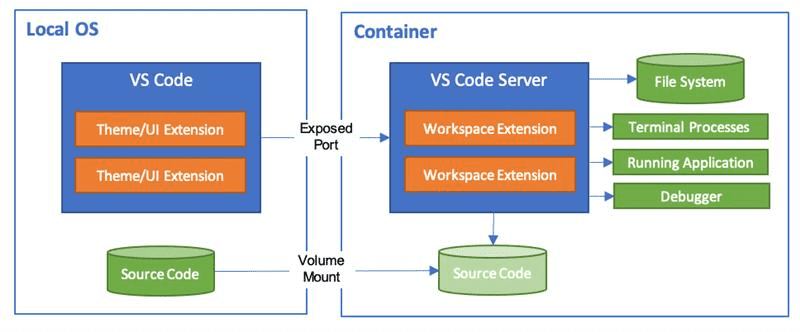

# 🚀 Prepare for the challenge

You will use GitHub Codespaces to work on the Contoso Real Estate `portal` project.

## What is GitHub Codespaces?

GitHub Codespaces is a cloud-hosted development environment. When you work in a codespace, the environment you're working in is created using a development container, or dev container, hosted on a virtual machine.

Development containers, or dev containers, are Docker containers that are specifically configured to provide a complete development environment.

You can configure the dev container for a repository so that codespaces created for that repository provide a custom development environment, complete with all the tools and runtimes you need to work on a specific project.

The diagram below, taken directly from the official [Visual Studio Code](https://code.visualstudio.com/docs/remote/containers/?WT.mc_id=academic-101248-cyzanon) documentation, illustrates this:

The Contoso Real Estate project is optimized for use with GitHub Codespaces, a cloud-hosted development environment from GitHub.

## Getting started

1. To get started, you will need a GitHub account. If you don't have an account, create one for free at [github.com](https://github.com/).

2. Activate the [GitHub Codespaces](https://docs.github.com/codespaces/) service on your GitHub account. Codespaces offers 60 hours of free usage per month.

3. You will need to make a copy of the template repository in your GitHub account. To do this, you will need to access the [repository](https://github.com/Azure-Samples/contoso-real-estate) and select the `Fork` button. At the end of the fork of the repository, you will have a copy of the project in your GitHub account. You will use this repository to develop the hands-on.

4. On the repository page that was created, click the `Code` button and, in the Codespaces tab, click `Create codespace on main`. In a few moments, Codespaces will create a development environment for you.

5. When Codespaces finishes creating the development environment, you will see a Visual Studio Code window in the browser. You can use Visual Studio Code in the browser to develop the application.

---

[**➡️ Exercise 1: Analyzing the portal project**](./01-analyzing-portal.md)
