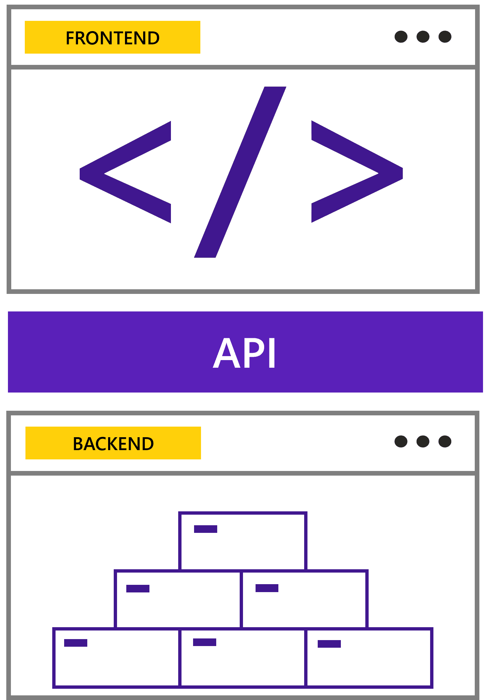

# 🔎 Exercise 1: Analyzing the `portal` project

The `portal` of the Contoso Real Estate project is a simulation of a real estate agency website where you can view the properties available for sale, rent, or buy. The architecture of the project was designed in a composable architecture.



Composable architecture is a software architecture that divides the application into smaller parts, where each part is responsible for a specific functionality. This architecture is also known as micro frontends.

**Advantages of using composable architecture:**

- **Reusability**: components can be reused in different parts of the application.
- **Scalability**: the application can be scaled horizontally, that is, it can be divided into smaller parts, and each part can be developed by a different team.
- **Maintainability**: the application can be maintained more easily as each component is responsible for a specific functionality.

## Project architecture

The Contoso Real Estate project is composed of three main parts:

- `portal`: is the main project, where it contains the home page and the components that will be used on all pages.
- `blog`: is the project that contains the real estate blog. In this project, `Strapi` is used as a CMS to manage blog posts.
- `api`: is the project that contains the APIs that will be used in the `portal` project.


### The `portal` components

This project was developed using Angular, and you will learn how it works, and how to run and deploy it using the Azure Static Web Apps CLI in Codespaces.

Accessing the `packages/portal/src/app` folder, you will see the components that make up the `portal`:

- `app`: main component of the application, responsible for rendering the other components.
  - `about`: about page
  - `authentication`: login page (authentication)
  - `checkoutpage`: checkout page
  - `homepage`: home page
  - `profile`: user profile page
  - `rentalpage`: rental page
  - `searchpage`: search page
  - `shared`: folder that contains the components of universal use in the application, such as buttons, inputs, etc.


### Environment variables

Within the `portal` project, we can see a folder called environments, which contains the configuration needed to run the project locally (or in Codespaces in this case), or in production. This is a good practice to avoid exposing sensitive data here, as these values are packaged within the application and can be retrieved easily.

For example, observe the excerpt below:

<details><summary><b>environments/environmet.ts</b></summary>
<br/>

  ```ts
    export const environment = {
      production: false,
      blogUrl: 'http://localhost:3000',
      isCodespaces: process.env["CODESPACE_NAME"] ? true : false,
      strapiGraphQlUriInCodespace: `https://${process.env["CODESPACE_NAME"]}-1337.${process.env["GITHUB_CODESPACES_PORT_FORWARDING_DOMAIN"]}/graphql`,
      strapiGraphQlUriFallback: 'http://localhost:1337/graphql'
    };
  ```

</details>
<br/>

As you can see, the `portal` is related to another scenario, which is the `Blog-CMS`. In this scenario, `Strapi` is used as a CMS to manage blog posts, but in this tutorial, we will focus only on the `portal`.

In the next exercise, you will learn how to run the `portal` project using the Azure Static Web Apps CLI.

---

[**➡️ Exercise 2: Working with Azure Static Web App CLI**](./02-exercise-swa-cli.md)
