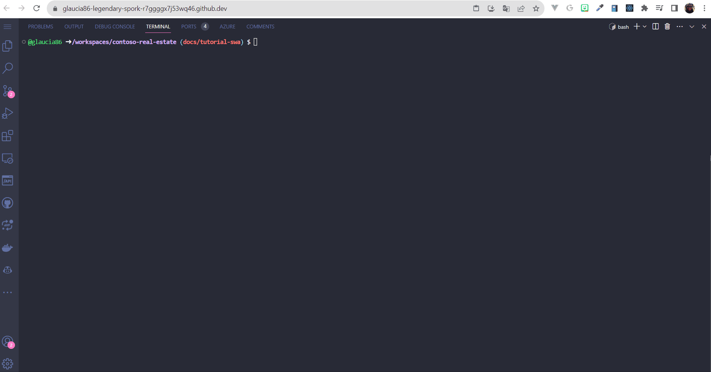
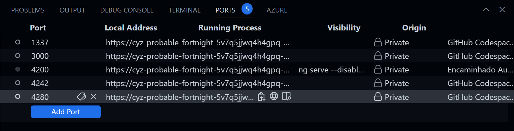
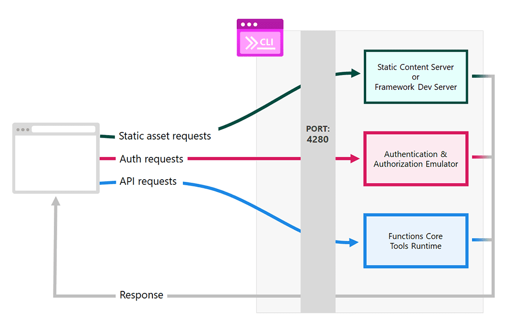

# 💻 Exercise 2: Working with Azure Static Web App CLI

In this exercise, you'll learn how to run the **Portal** project in Codespaces and how to use the Azure Static Web Apps CLI to handle communication between the frontend and backend.

## What is Azure Static Web App CLI?

The **[Azure Static Web Apps (SWA) CLI](https://github.com/Azure/static-web-apps-cli/?WT.mc_id=academic-101248-cyzanon)** is an open-source command-line tool that simplifies local development and deployment to Azure Static Web Apps. It allows you to run your app locally or in a dev container, which in this case is GitHub Codespace, and then deploy your app to a production environment with just one command.

## How does the communication between frontend and backend work?

When we use the Azure Static Web CLI, we can establish communication between the Back-End and Front-End through the file: `swa-cli.config.json`.

This file can be generated once you have globally installed the package: **[@azure/static-web-apps-cli](https://www.npmjs.com/package/@azure/static-web-apps-cli)**, by executing the following command inside the folder: **Portal**.

```bash
swa init
```

Please see the step-by-step creation of the file in the image below:



Once the file is generated according to the project settings, please observe in the code below that the `swa-cli.config.json` file has the following properties:

<details><summary><b>packages/portal/swa-cli.config.json</b></summary>
<br/>

  ```json
    {
      "$schema": "https://aka.ms/azure/static-web-apps-cli/schema",
      "configurations": {
        "contoso-real-estate": {
          "appLocation": ".",
          "apiLocation": "../api",
          "outputLocation": "dist/contoso-app",
          "appBuildCommand": "npm run build",
          "apiBuildCommand": "npm run build",
          "run": "npm start",
          "appDevserverUrl": "http://localhost:4200",
          "apiDevserverUrl": "http://127.0.01:7071"
        }
      }
    }
  ```
</details>
<br/>

The backend is located in the `packages/api` folder and it is defined in the `apiLocation` property. The frontend is located in the `packages/portal` folder and it is defined in the `appLocation` property. In both cases, the `appdevserverUrl` and `apiDevserverUrl` properties point to the URLs of the development servers.

The Contoso Real Estate project API was developed in Azure Functions and Azure Cosmos DB (MongoDB API). The Azure Static Web Apps CLI automatically runs the Azure Functions emulator when it detects that an Azure Functions API is used in the project.

## How to run the `portal` project?

We do not recommend running this project locally, as it requires a number of configurations to work. To optimize your learning, we recommend using **[Codespaces](https://github.com/features/codespaces)** which will create a development container for you. And the best part of all: without you having to install anything on your machine.

> Codespaces offers 60 free hours of usage per month. After this period, you will be charged an hourly rate. To learn more, visit [Codespaces](https://github.com/features/codespaces).

To run the project in your Visual Studio Code in Codespaces, follow the steps below:

1. As all the scenarios of the project are coupled, so that we can visualize what was created in the portal, it will be necessary to perform the following steps:
  - Open the Visual Studio Code terminal and, at the root of the Contoso project, run the commands `npm install && npm start` to install the project dependencies and start the servers.

  > _Note: Codespaces will show a number of windows on the right side of the screen as it starts up all the servers. This is expected and normal._

2. Once all the development servers have started, the following URLs will be available:

| Application    | URL                                                      | Port |
| -------------- | -------------------------------------------------------- | ---- |
| Portal         | https://YOUR-REPO-4280.preview.app.github.dev:4280       | 4280 |
| Blog           | https://YOUR-REPO-3000.preview.app.github.dev:3000       | 3000 |
| Strapi CMS     | https://YOUR-REPO-1337.preview.app.github.dev:1337/admin | 1337 |
| Serverless API | https://YOUR-REPO-7071.preview.app.github.dev:7071/api/  | 7071 |
| Stripe API     | https://YOUR-REPO-4242.preview.app.github.dev:4242       | 4242 |

> _Note: The URLs above are just examples. The URLs will be different for your fork. The ports, however, will be the same._

3. To view the project, go to the `Ports` tab of the terminal and click on the portal link, which will be port `4280` (the default port of the ASWA), to see the portal home page.



If you want to see the portal, go to the `Ports` tab of the terminal and click on the portal link, which will be port `4280`, to see the portal home page. The page will be blank, as you need to integrate the API with the portal.

The example below shows the portal home page with the sample data.


### Understanding the `Portal` project execution

As explained in the previous item, the Contoso project was developed in a **Composable Architecture** model; that is, it is composed of several components, where each component is responsible for a specific functionality. **For this reason, the execution of this project is coupled.**

**How can we check this?**

Open the `package.json` file at the root of the Contoso project and observe the scripts below:

<details><summary><b>packages/portal/package.json</b></summary><br/>

  ```json
    "scripts": {
      "start": "concurrently npm:start:* --kill-others",
      "start:services": "docker compose up",
      "start:api": "npm run start --workspace=api",
      "start:website": "npm run start:swa --workspace=portal",
      "test": "npm run test -ws --if-present",
      "build": "npm run build -ws --if-present",
      "format": "prettier --write .",
      "format:check": "prettier --check .",
      "lint": "npm run lint -ws --if-present",
      "lint:fix": "npm run lint:fix -ws --if-present",
      "clean": "rimraf \"packages/**/*.tsbuildinfo\"",
      "clean:install": "rimraf \"packages/**/node_modules\" \"node_modules\" && npm install"
    }
  ```
</details>
<br/>

Checking the scripts:

**Docker compose**

```json
  "start:services": "docker compose up"
```

This file is responsible for starting the docker services, which are Strapi CMS and Stripe API. In addition, this `docker compose` is configured to start the Azure Database for PostgreSQL database of Strapi CMS and the Stripe API, and, in the API, it is configured to start the Azure Cosmos DB database integrated with MongoDB.

**API**
```json
  "start:api": "npm run start --workspace=api"
```

Responsible for running the `API` project.

**Portal**
```json
  "start:website": "npm run start:swa --workspace=portal"
```

Responsible for running the `portal` project.

#### Understanding the Heart of the SWA CLI: Reverse Proxy

This is the heart of the SWA CLI. It intercepts and forwards HTTP requests to the right components based on purpose:

- `/.auth/**` requests => forwarded to the Auth emulator server.
- `/api/**` requests => forwarded to the API backend (if configured).
- `/**` => all other requests forwarded to the static assets content server.



That's why we can connect the portal to the API without having to configure anything. The SWA CLI does this for us. You can learn more about the Azure Static Web Apps CLI at [https://azure.github.io/static-web-apps-cli/docs/intro/](https://azure.github.io/static-web-apps-cli/docs/intro/?WT.mc_id=academic-101248-cyzanon).

In the next exercise, you will learn how to deploy the `portal` project on Azure Static Web Apps.

---

[**➡️ Exercise 3: Deploy on Azure Static Web App**](./03-exercise-portal-deploy.md)
