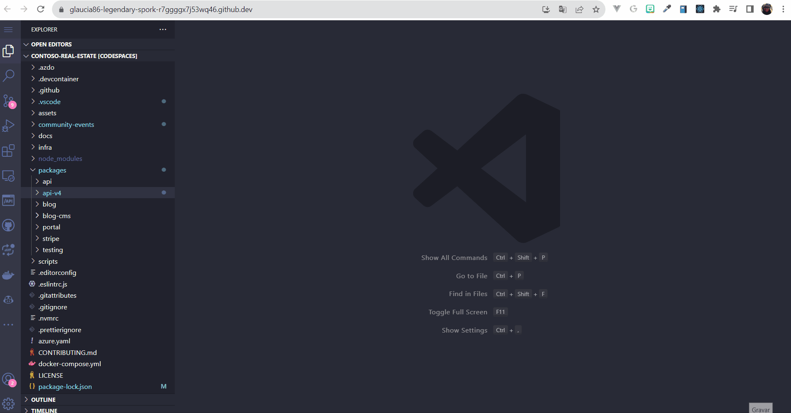

# Exercise 1: Criando a API do projeto

Neste exercício, você irá aprender a implementar a API do projeto Contoso Real Estate utilizando o modelo de programação V4 do Node.js (Preview) do Azure Functions e o Azure Cosmos DB (MongoDB API).

## Pré-requisitos

Para seguir com este tutorial será necessário conhecimentos básicos em:

- TypeScript
- Codespaces
- Azure Functions
- Azure Cosmos DB + MongoDB API
- Mongoose

## Criando o projeto

Para este projeto, usaremos a versão 4 do modelo de programação do Node.js (Preview) para o desenvolvimento de nossa API com Azure Functions.

> Caso você já tenha um projeto no v3, você pode migrar para o v4 seguindo [este tutorial](https://learn.microsoft.com/azure/azure-functions/functions-node-upgrade-v4?tabs=azure-cli-set-indexing-flag%2Cv4).

1. Dentro da pasta `packages` crie uma pasta chamada `api-v4`. Para desenvolver a API, usaremos a [extensão do Azure Functions para o Visual Studio Code](https://learn.microsoft.com/azure/azure-functions/functions-node-upgrade-v4?tabs=azure-cli-set-indexing-flag%2Cv4), já instalada no Codespaces.

2. Pressione `F1` para abrir a paleta de comandos. Na paleta de comandos, pesquise e selecione `Azure Functions: Create new project....`.Se você não estiver logado no Azure, clique na opção `Sign in to Azure...` e siga as instruções para fazer o login. link para o azure for students

3. na caixa de diálogo `Select the folder that will contain your function project`, clique em `Browse` e navegue até a pasta criada, que será `/workspaces/contoso-real-estate/packages/api-v4/` e dê `OK` > selecione a opção `Typescript` > `Model V4 (Preview)` > `HTTP Trigger` > name `users` > enter (cancela o overwrite box)

Observe que, quando é criado uma nova function, a estrutura do projeto comparado com o v3 é diferente do v4:


4. Agora, vamos testar e ver se essa function `users.ts` executará corretamente? Para isso, abre o terminal do Visual Studio Code e execute o comando abaixo:

```bash
cd packages/api-v4

npm start
``` 

Se tiverem dúvidas como executar, podem acompanhar o passo a passo no gif abaixo:




