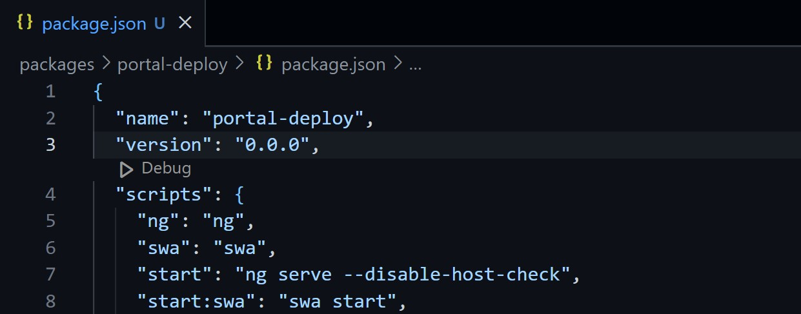
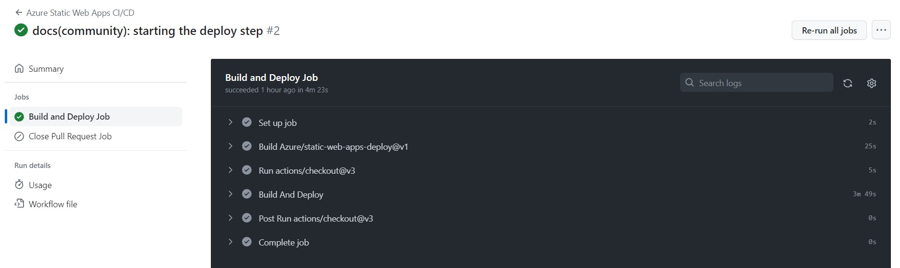
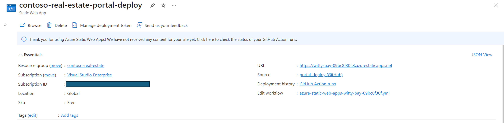

# Exercise 3: Deploy on Azure Static Web App

In this exercise, you will learn how to deploy the **Portal** project on Azure using the Azure Static Web Apps CLI and GitHub Actions.

You'll need to use your Azure account for this exercise. If you don't have an account, create a free [Azure Free Trial](https://azure.microsoft.com/free/) or use the [GitHub Student Developer Pack — GitHub Education](https://education.github.com/pack) program.

## Preparing the scenario

To deploy the `portal`, you will need to create a new branch in your GitHub repository and follow some configuration steps.

To do this, run the following commands in the Visual Studio Code terminal in Codespaces:

**Creating a new branch**

```bash
  git checkout -b portal-deploy
```

Make a copy of the `portal` folder and rename it to `portal-deploy`. Duplicating the folder is necessary so that we can deploy the `portal` in isolation, without having to deploy the `blog` and `api`.

**Creating a copy via terminal**

```bash
  cp -r packages/portal packages/portal-deploy
```

With the `portal-deploy` folder created, access the file `packages/portal-deploy/package.json` and change the `name` property to `portal-deploy`.



Now, go back to the terminal, as we will run some routines with basic linux commands and configure the project deploy with the Azure Static Web Apps CLI.

**Navigating to the portal-deploy folder**

```bash
  cd packages/portal-deploy
```

**Delete existing files**

We need to delete the `packages/portal/node_modules` folder and the `swa-cli.config.json` file. To do this, we will use the linux command `rm -rf`. The -r is used to delete folders and the -f is used to force deletion.

Removing the node_modules folder:

```bash
  rm -rf node_modules
```

Removing the swa-cli.config.json file:

```bash
  rm -rf swa-cli.config.json
```

**Installing dependencies**

```bash
  npm install
```

**Installing Azure Static Web Apps CLI as a development dependency**

```bash
  npm install -D @azure/static-web-apps-cli
```

## Azure Static Web Apps (SWA) CLI

With the initial settings completed, you will need to initialize Azure Static Web Apps so that we can deploy the `portal` to Azure.

To do this, use the terminal to navigate to the root of the Contoso Real Estate project by running the following command:

```bash
  cd ../..
```

**Initialize Azure Static Web Apps**

```bash
  swa init
```

The SWA CLI will identify the existing projects in Contoso Real Estate and you should choose the `portal-deploy`. Check if the project name is correct and press `y` to confirm.


A `swa-cli.config.json` file will be generated and will have the following information:

```json
  {
    "$schema": "https://aka.ms/azure/static-web-apps-cli/schema",
    "configurations": {
      "contoso-real-estate": {
        "appLocation": "packages/portal-deploy",
        "apiLocation": "packages/api",
        "outputLocation": "dist/contoso-app",
        "apiLanguage": "node",
        "apiVersion": "16",
        "appBuildCommand": "npm run build",
        "apiBuildCommand": "npm run build --if-present",
        "run": "npm start",
        "appDevserverUrl": "http://localhost:4200"
      }
    }
  }
```

Note that the `appLocation` property is pointing to the `portal-deploy` folder, which is the project we will deploy.

**Execution test**

```bash
  swa start
```

During execution, a popup will open in the lower right corner of Visual Studio Code. Click on the `Ports` tab and check if port `4280` is open. If it is, click the `Open Browser` button so you can view the portal.


### Creating the artifacts

Artefacts are the files that will be sent to Azure Static Web Apps. Artifacts are static files, such as HTML, CSS, JavaScript, and images, that are generated by the build process. All artefacts generated by the SWA CLI are stored in the `dist/contoso-app` folder. To generate the `portal` artefacts, run the following command:

```bash
  swa build
```

### Configuring GitHub Actions

Now that we already have the generated artefacts, we need to configure GitHub Actions so that the `portal-deploy` is published on Azure Static Web Apps.

To do this, access the Azure portal and create a new Azure Static Web Apps following the steps below:

1. Access the Azure portal and click the `Create a resource` button.
2. In the search bar, type `Static Web Apps` and click on the first result.
3. Click the `Create` button.
4. On the "Create Static Web App" page, fill in the following information:
    - *Subscription*: Select your Azure subscription.
    - *Resource Group*: Click the `Create new` button and type the name `contoso-real-estate`.
    - *Name*: Type the name `contoso-real-estate-portal-deploy`.
    - *Plan type*: Select the `Free` option.
    - *Region*: Select the region closest to you.
    - *Source*: Select the `GitHub` option. You will need to log in with your GitHub account so that Azure can access your repositories.
    - *Organization*: Select your GitHub organization.
    - *Repository*: Select the `contoso-real-estate` repository.
    - *Branch*: Select the `portal-deploy` branch.
    - *Build Presets*: Select the `Angular` option.
    - *App location*: Type the path `packages/portal-deploy`.
    - *Api location*: Type the path `packages/api`.
    - *Output location*: Type the path `dist/contoso-app`.
5. Click the `Review + create` button.
6. Click the `Create` button.

Access your repository on Github and click on the `Actions` tab. You will see that GitHub Actions has already created a workflow called `Azure Static Web Apps CI/CD` and it will be running.

The steps we performed in the Azure portal, during the creation of Azure Static Web Apps, generated a new file in the `.github/workflows` folder. This file is responsible for deploying the `portal-deploy` on Azure Static Web Apps.

You can follow the progress of the deploy in GitHub Actions or in Azure Static Web Apps.



With the execution completed, access the link generated by Azure Static Web Apps. You will see the portal running on Azure.



Congratulations! You have successfully deployed the `portal` on Azure Static Web Apps.