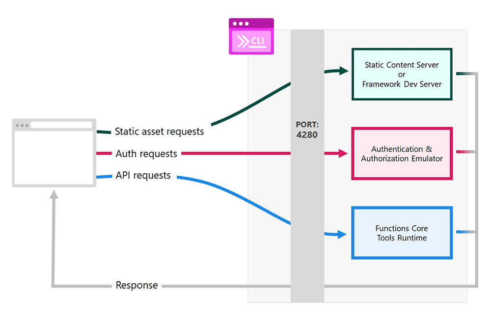

# Exercise 3: Working with Azure Static Web App CLI

<!-- brief explanation of intro -->

## What is Azure Static Web App CLI?

The [Azure Static Web Apps (SWA) CLI](https://github.com/Azure/static-web-apps-cli) is an open-source command-line tool that simplifies local development and deployment to Azure Static Web Apps. It allows you to run your app locally or in a dev container, which in this case is GitHub Codespace, and then deploy your app to a production environment with just one command.

## How does the communication between frontend and backend work?

The standard communication structure between frontend and backend in an Angular project is through a `services.ts`. In the `portal` project of the Contoso Real Estate project, communication is managed through the Azure Static Web App CLI.

The settings for this communication are done through a file called `swa-cli.config.json`, which will be executed when the route is called.

<details><summary><b>packages/portal/swa-cli.config.json</b></summary>
<br/>

  ```json
    {
      "$schema": "https://aka.ms/azure/static-web-apps-cli/schema",
      "configurations": {
        "contoso-real-estate": {
          "appLocation": ".",
          "apiLocation": "../api",
          "outputLocation": "dist/contoso-app",
          "appBuildCommand": "npm run build",
          "apiBuildCommand": "npm run build",
          "run": "npm start",
          "appDevserverUrl": "http://localhost:4200",
          "apiDevserverUrl": "http://127.0.01:7071"
        }
      }
    }
  ```
</details>
<br/>

Note the `appDevserverUrl` and `apiDevserverUrl` properties, which contain the paths to the frontend and backend, respectively. The `apiLocation` property contains the path to the `API` project, which was covered in the first exercise of this tutorial.

## How to run the `portal` project?

We do not recommend running this project locally, as it requires a number of configurations to work. To optimize your learning, we recommend using [Codespaces](https://github.com/features/codespaces) which will create a development container for you. And the best part of all: without you having to install anything on your machine.

> Codespaces offers 60 free hours of usage per month. After this period, you will be charged an hourly rate. To learn more, visit [Codespaces](https://github.com/features/codespaces).

To run the project, follow the steps below:

1. You will need to make a copy of the template repository in your GitHub account. To do this, you will need to access the [repository](https://github.com/Azure-Samples/contoso-real-estate) and `Fork`. At the end of the fork of the repository, you will have a copy of the project in your GitHub account.

2. On the repository page that was created, click the `Code` button and, in the Codespaces tab, click `Create codespace on main`. In a few moments, Codespaces will create a development environment for you.

3. When Codespaces finishes creating the development environment, you will see a Visual Studio Code window in the browser. You can use Visual Studio Code in the browser to develop the application.

4. As all the scenarios of the project are coupled, so that we can visualize what was created in the portal, it will be necessary to perform the following steps:
  - Open the Visual Studio Code terminal and, at the root of the Contoso project, run the commands `npm install && npm start` to install the project dependencies.

  > _Note: Codespaces will show a series of windows on the right side of the screen while it starts all the servers. This is normal and expected._

5. Once all the development servers have started, the following URLs will be available:

| Application    | URL                                                      | Port |
| -------------- | -------------------------------------------------------- | ---- |
| Portal         | https://YOUR-REPO-4280.preview.app.github.dev:4280       | 4280 |
| Blog           | https://YOUR-REPO-3000.preview.app.github.dev:3000       | 3000 |
| Strapi CMS     | https://YOUR-REPO-1337.preview.app.github.dev:1337/admin | 1337 |
| Serverless API | https://YOUR-REPO-7071.preview.app.github.dev:7071/api/  | 7071 |
| Stripe API     | https://YOUR-REPO-4242.preview.app.github.dev:4242       | 4242 |

> _Note: The URLs above are just examples. The URLs will be different for your fork. The ports, however, will be the same._

6. To view the project, go to the `Ports` tab of the terminal and click on the portal link, which will be port `4280` (the default port of the ASWA), to see the portal home page.

<!-- imagem: portas do terminal -->

<!-- mencionar a possibilidade de acesso a URL para testar -->

### Understanding the execution

As explained in the previous item, the Contoso project was developed in a `composable architecture` model; that is, it is composed of several components, where each component is responsible for a specific functionality. **For this reason, the execution of this project is coupled.**

**How can we check this?**

Open the `package.json` file at the root of the Contoso project and observe the scripts below:

<details><summary><b>packages/portal/package.json</b></summary><br/>

  ```json
    "scripts": {
      "start": "concurrently npm:start:* --kill-others",
      "start:services": "docker compose up",
      "start:api": "npm run start --workspace=api",
      "start:website": "npm run start:swa --workspace=portal",
      "test": "npm run test -ws --if-present",
      "build": "npm run build -ws --if-present",
      "format": "prettier --write .",
      "format:check": "prettier --check .",
      "lint": "npm run lint -ws --if-present",
      "lint:fix": "npm run lint:fix -ws --if-present",
      "clean": "rimraf \"packages/**/*.tsbuildinfo\"",
      "clean:install": "rimraf \"packages/**/node_modules\" \"node_modules\" && npm install"
    }
  ```
</details>
<br/>

Checking the scripts:

**Docker compose**

```json
  "start:services": "docker compose up"
```

Responsible for starting the docker services, which are Strapi CMS and Stripe API. In addition, this `docker compose` is configured to start the Azure Database for PostgreSQL database of Strapi CMS and the Stripe API, and, in the API, it is configured to start the Azure Cosmos DB database integrated with MongoDB.


**API**
```json
  "start:api": "npm run start --workspace=api"
```

Responsible for running the `API` project.

**Portal**
```json
  "start:website": "npm run start:swa --workspace=portal"
```

Responsible for running the `portal` project.

#### Reverse Proxy

This is the heart of the SWA CLI. It intercepts and forwards HTTP requests to the right components based on purpose:

- `/.auth/**` requests => forwarded to the Auth emulator server.
- `/api/**` requests => forwarded to localhost functions (if present).
- `/**` => all other requests forwarded to the static assets content server.



<!-- explicação da proxy no projeto -->

You can learn more about the Azure Static Web Apps CLI at [https://azure.github.io/static-web-apps-cli/docs/intro/](https://azure.github.io/static-web-apps-cli/docs/intro/).

In the next exercise, you will learn how to deploy the `portal` project on Azure using the Azure Static Web Apps CLI.