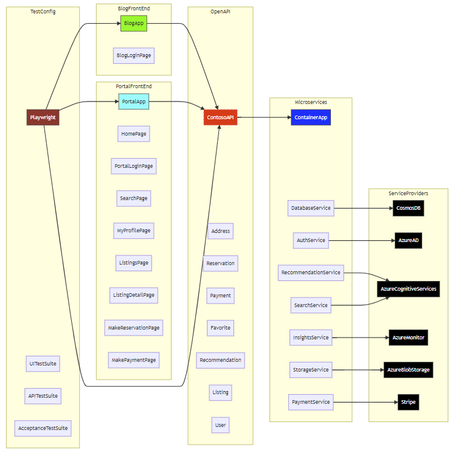

# Enterprise-grade Reference Architecture for JavaScript

This repository contains the reference architecture and components for building enterprise-grade modern composable frontends (or micro-frontends) and cloud-native applications. It is a collection of best practices, architecture patterns, and functional components that can be used to build and deploy modern JavaScript applications to Azure.

[Additional details about what the Contoso Real Estate app is and what it does from a high-level – possibly has some images from the running app].

### Supported App Scenarios

The following scenarios are part of the application sample

- [AI Chatbot integration (RAG Pattern)](./chatbot-integration-scenario.md)

- [Payments integration with Stripe](./payments-service-scenario.md)

- Real-time Notifications 

- Portal application, a main portal entry point, featuring listings, favorites, user authentication and profile

- [Headless CMS and blog](./blog-scenario.md)

## Developer guidelines

The page you're reading and other documentation in this folder, are a summary guide. The project has a standalone [Developer Guide](./packages/docs/website/README.md) defined under `packages/docs` and implemented as an interactive website using the [Docusaurus](https://docusaurus.io) platform. To learn more about it, [go here](./packages/docs/website/developer-guidelines.md).

# Contoso Rentals Overview

Contoso Corporation is a fictional but representative global manufacturing conglomerate with its headquarters in Paris. The company deployed Microsoft 365 for enterprise and addressed major design decisions and implementation details for networking, identity, Windows 10 Enterprise, Microsoft 365 Apps for enterprise, mobile device management, information protection, and security.

The company's overall goal for Microsoft 365 for enterprise is to accelerate its digital transformation by using cloud services to bring together its employees, partners, data, and processes to create customer value and maintain its competitive advantage in a digital-first world.

Contoso has 3 office tiers (Headquarters, Regional and Satellite) with a total of almost 30K employees.

Contoso is expanding its configuration, and rolling out to new regions and countries, which will result in massive hiring. They offer relocation and have designed an application, to help HR and new hires find the right housing. This web app is an internal tool used by Contoso HR and new hire or relocating employees.

The Contoso HR App is part of the Contoso platform and designed to serve internal users. Both authenticated Talent Managers, and new hires can interact with the application features, while non-authenticated users can access some parts of it.

## App architecture

To support this app functionality, the Contoso engineering team used the following structure:

- Web app with a custom domain
  - UI for blog and portal front ends
  - API layer to communicate between client and cloud
  - Microservices for cloud integrations
    - Identity for authentication and authorization
    - Storage for rental property images and rental contracts
    - Database for rental property details
    - Recommendation engine
    - Site search
    - Monitoring
    - Payments

## Azure architecture

To build, deploy, manage, test, and monitor this web app, Contoso selected Azure. With the help of Azure architects, the following architecture was selected.

