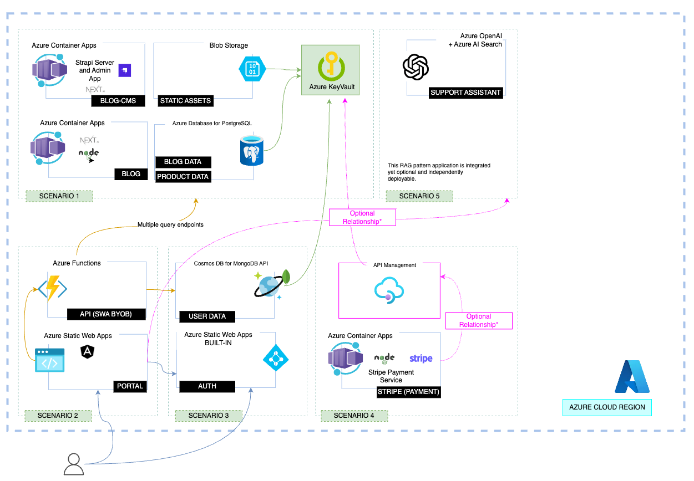

# AI Chatbot integration

You can optionally integrate an AI support chatbot with within the Contoso Real Estate application. 
This chatbot is developed and maintained as an independant code sample [here](https://github.com/Azure-Samples/azure-search-openai-javascript), and must be deployed separately using the following instructions if you want to integrate it with the Contoso Real Estate application.

## Prerequisites

In order to deploy and run the chatbot sample, you'll need:

- **Azure account**. If you're new to Azure, [get an Azure account for free](https://learn.microsoft.com/azure/search/search-what-is-azure-search) to get free Azure credits to get started.
- **Azure subscription with access enabled for the Azure OpenAI service**. You can request access with [this form](https://aka.ms/oaiapply).
- **Azure account permissions**:
  - Your Azure account must have `Microsoft.Authorization/roleAssignments/write` permissions, such as [Role Based Access Control Administrator](https://learn.microsoft.com/azure/role-based-access-control/built-in-roles#role-based-access-control-administrator-preview), [User Access Administrator](https://learn.microsoft.com/azure/role-based-access-control/built-in-roles#user-access-administrator), or [Owner](https://learn.microsoft.com/azure/role-based-access-control/built-in-roles#owner). If you don't have subscription-level permissions, they must be granted to you with [RBAC](https://learn.microsoft.com/azure/role-based-access-control/built-in-roles#role-based-access-control-administrator-preview) for an existing resource group and [deploy to that existing group](#existing-resource-group).
  - Your Azure account also needs `Microsoft.Resources/deployments/write` permissions at a subscription level.

## Integration instructions

Follow these steps to enable the AI chatbot integration:

1. Clone the Chat sample in the Contoso Real Estate repository. To avoid misconfiguration, consider cloning it at root level, in a subfolder:

    ```bash
    git clone https://github.com/Azure-Samples/azure-search-openai-javascript.git chat-sample
    ```

2. Follow the instructions in the [Chat sample README](https://github.com/Azure-Samples/azure-search-openai-javascript#azure-deployment) to deploy the chatbot to your Azure subscription.

3. After the Chat sample is deployed, run the following commands to get the chatbot API URL:
    ```bash
    cd chat-sample
    azd env get-values | grep SEARCH_API_URI
    cd ..
    ```

    Copy the value of the `SEARCH_API_URI` variable. You'll need it in the next step.

    > **Note:** Make sure to get the URL without any trailing slash.

4. In the Contoso Real estate repository, run the following commands:

    ```bash
    azd env set AI_CHAT_API_URI <the_chatbot_api_url>
    azd env set AI_ENABLE_CHAT true
    ```

5. Replace this line in `packages/portal/angular.json` file:

    ```json
    "scripts": [],
    ```

    with this line:

    ```json
    "scripts": [
      "../../chat-sample/packages/chat-component/dist/chat-component.umd.cjs"
    ],
    ```
** The path may vary, depending on the location of your clone.

You're almost done! Now it's a good idea to test the integration to make sure everything is working as expected.

### Testing AI chatbot integration locally

To test the integration locally, open a terminal in the Contoso Real Estate repository and run the following commands:

```bash
export AI_CHAT_API_URI=<the_chatbot_api_url>
export AI_ENABLE_CHAT=true

npm run start
```

This will start the application in development mode. Open your browser and navigate to `http://localhost:4280` to see the application running.

If the chatbot integration is working correctly, you should see a **Support chat** link in the footer navigation. Click on this link and you should be able to test the chatbot.

### Deploying the application with the AI chatbot integration

To deploy the Contoso Real Estate application with the chatbot integration enabled, there are a few extra steps you need to take.

1. First, deploy the Contoso Real Estate application once following the instructions in the [README.md](../README.md#deploy-to-azure).

2. Once the application is deployed, run this command to get the Portal URL:

    ```bash
    azd env get-values | grep SERVICE_WEB_URI
    ```

    Copy the value of the `SERVICE_WEB_URI` variable. You'll need it in the next step.

    > **Note:** Make sure to get the URL without any trailing slash.

3. Run this command to allow requests from the Portal URL in the Chat API and redeploy the Chat sample:
  
    ```bash
    cd chat-sample
    azd env set ALLOWED_ORIGIN <the_portal_url>
    azd up
    ```

That's it! Now you can navigate to the Portal URL and test the chatbot integration.

### Chat integration scenario diagram

This scenario is represented by the following diagram

