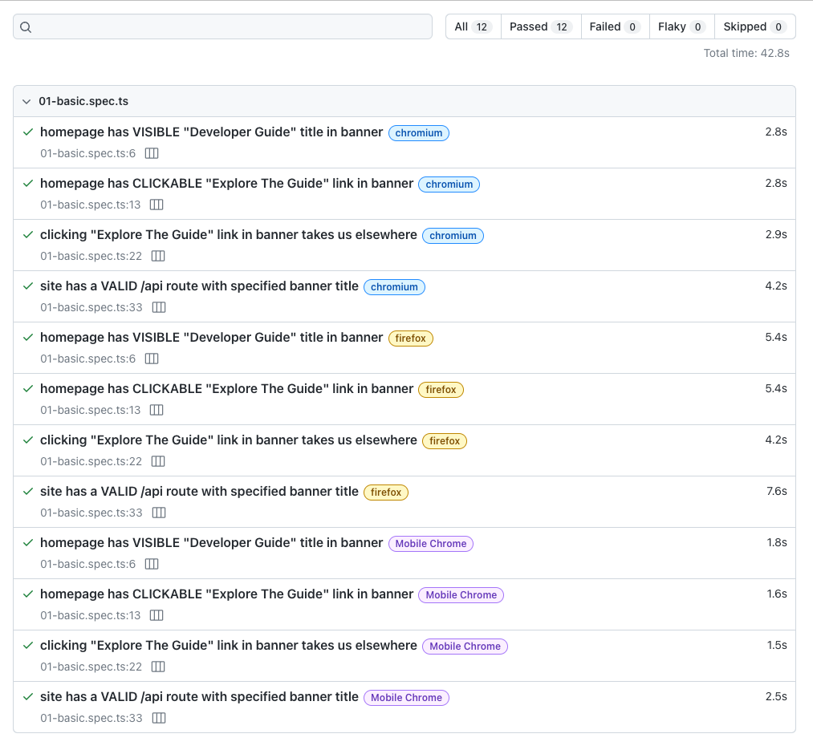

The project has a [Developer Guide](./packages/docs/website/README.md) defined under `packages/docs` and implemented as an interactive website using the [Docusaurus](https://docusaurus.io) platform.

### 1 | Preview Website

- Read the [website/README](./packages/docs/website/README.md) for more details on setting up and building this package.
- Use the following instructions for a quickstart.

```bash
$ cd packages/docs/website     # Set working directory
$ npm install                  # Install dependencies
$ npm run start                # Run dev server, launch preview
..
[INFO] Starting the development server...
[SUCCESS] Docusaurus website is running at: http://localhost:3000/
```

This should launch the browser to the landing page of the guide as shown below:

<p align="center">
  
</p>

### 2 | Deploy Website

This repo is not configured for automated deployment of the website to a static site hosting service. However Docusaurus provides [Deployment guidance](https://docusaurus.io/docs/deployment) that works for most options - we've validated this for [Azure Static Web Apps](https://docusaurus.io/docs/deployment#deploying-to-azure-static-web-apps) and [GitHub Pages](https://docusaurus.io/docs/deployment#deploying-to-github-pages).

If you want a hosted version of the guide, we recommend you maintain a personal fork and set it up for automated build-deploy with GitHub Actions. Then keep up-to-date with origin, for content.

- See [this personal fork](https://github.com/30DaysOf/contoso-real-estate) for a working example for reference
- Visit [this GitHub Pages endpoint](https://30daysof.github.io/contoso-real-estate/) to see the associated live deployment.
- Note that this example may _not always reflect the latest repo changes_ in content.

### 3 | Test Website

The website comes with its own Playwright testing harness with a separate configuration and a base test specification. Use it for _test-driven documentation_ to validate the existence of routes and sections, and check content for accessibility compliance. _Note - this test suite is separate from e2e testing setup for Contoso Real Estate application (located in `packages/testing`_).

- Learn more about test setup in [website/README.TESTING.md](./packages/docs/website/README.md).
- Use the following instructions for a quickstart.

```bash
$ cd packages/docs/website     # Set working directory
$ npm install                  # Install dependencies
$ npm run test                 # Run dev server => launches browser to preview
$ npm run report               # View last HTML report => open browser to specified URL
```

Want to understand what the test report provides? You can explore [this cached version of the report](https://30daysof.github.io/contoso-real-estate/playwright-trace/) interactively (screenshot below) to dive into detailed traces. Note that the cached version _will not reflect the latest codebase updates_ and is meant only as an example.

<p align="center">
  
</p>