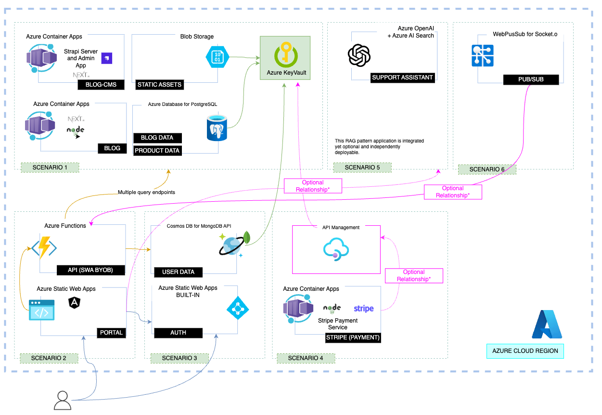

# Contoso Real Estate App: Portal Package

**IMPORTANT: THIS REPOSITORY IS OPTIMIZED FOR CODESPACES AND TO WORK AS A SET OF COMPOSABLE APPS AND APIS. STANDALONE PACKAGE FUNCTIONALITY IS LIMITED AND MAY REQUIRE ADDITIONAL CONFIGURATION OR DEVELOPMENT**

This document will guide you through the prerequisites and commands necessary to setup and preview the real time notifications service. 

## Prerequisites

**IMPORTANT: THIS SCENARIO IS TIGHTLY COUPLED WITH SCENARIOS 1 and 2. SOME PARTS OF THIS APP MAY NOT WORK AS EXPECTED IF YOU DON'T FOLLOW THE INSTRUCTIONS IN SCENARIOS 1 and 2, corresponding to the Headless CMS and Blog features, and the portal app.**

## Steps to enable the service

1 - Create a Web PubSub For Socket.IO resource.
Click key tab in resource portal, copy connection string.

2 - Rename .env.example under packages/realtime/ to .env. Then fill in copied connection string to variable WebPubSubConnectionString

3 - Copy the endpoint part in connection string (e.g. https://<resource-name>.webpubsub.azure.com). And use it replace the default endpoint in packages/portal/src/app/shared/realtime.service.ts:L14
Follow original README to go on.

### Real-time notification service scenario diagram

This scenario is represented by the following diagram

