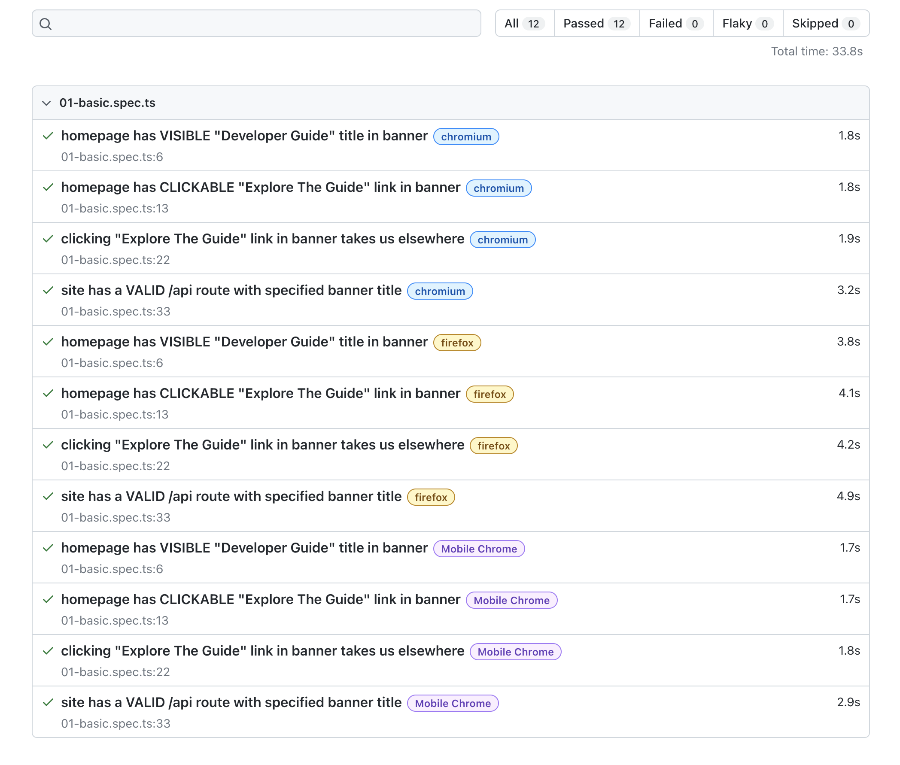
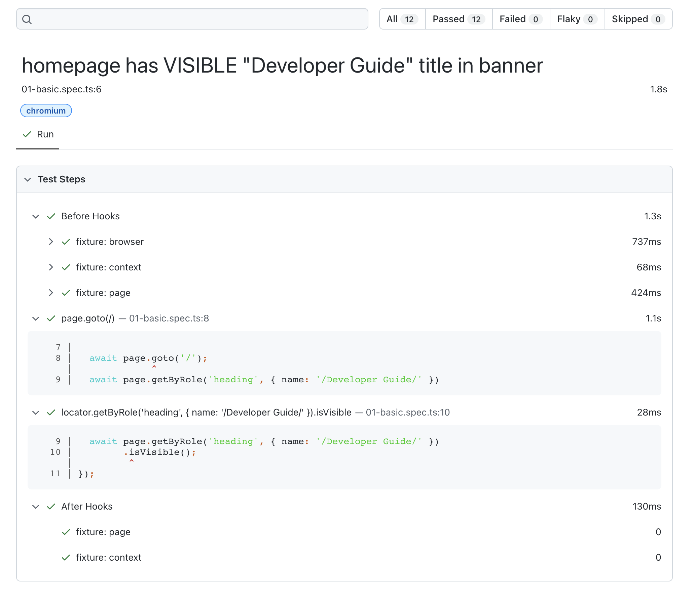
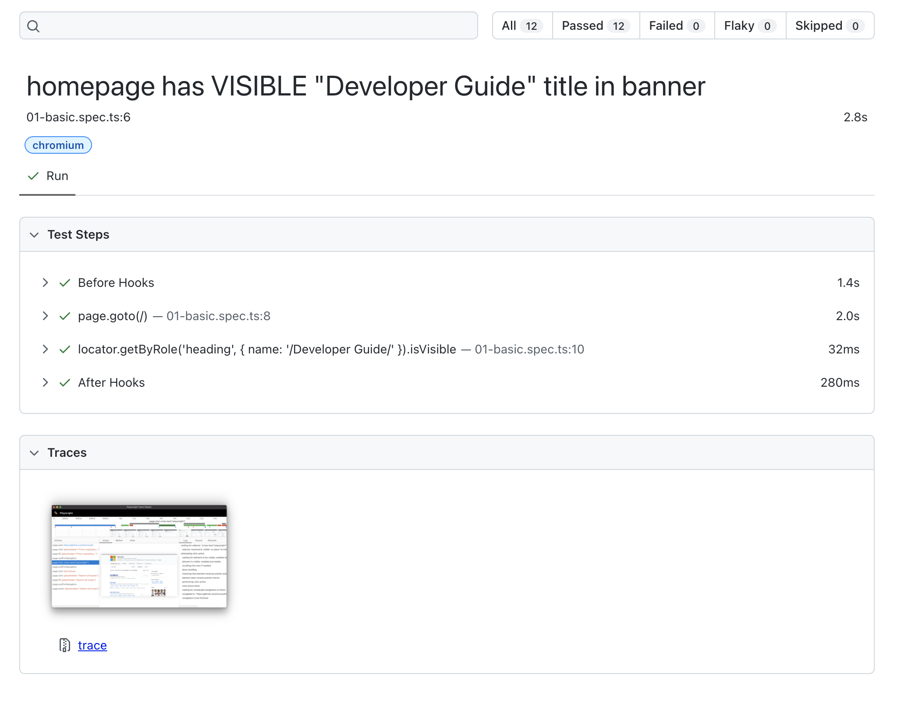
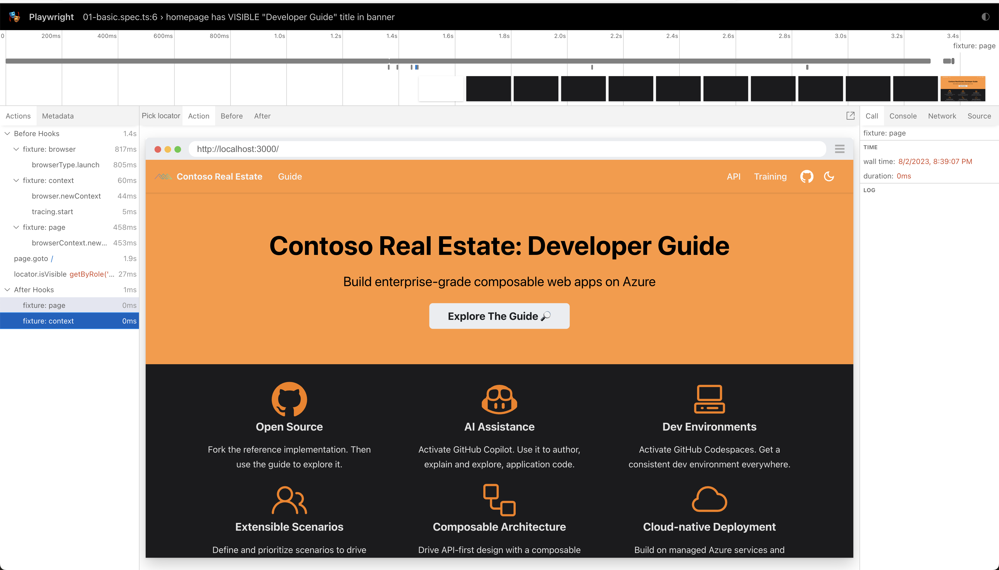

# Website Testing with Playwright

## 1. Quickstart

<details>
<summary> 👉🏽 | Want the quickest start to testing? Try this! </summary>

Make sure that you don't have anything running already on port `3000` (default dev server port for Docusaurus) first before you follow the script below.

```bash
# Change to website directory
$ cd bash

# Make sure you have Node.js v18+ and install dependencies
$ npm install

# Run the Playwright test
$ npm run tests

# View the Playwright generated HTML test report
$ npm run report
  Serving HTML report at http://localhost:9323. Press Ctrl+C to quit.

🎭 And you're done!!!
```

What the Playwright command just did for you:
 1. Built the website for dev preview
 2. Start the dev server for Docusaurus (on port 3000)
 3. Launch the test runner to test against the dev server preview
 4. Print the summary of test results to console
 5. Generate an HTML report with more details on tests
 6. Launch the browser to preview the _last-generated_ report.

 </details>

## 2. Reporting

<details>
<summary> 👉🏽 | Want to view the test results? Check the reports </summary>

Before we look under the hood, let's take a quick look at what the report looks like and correlate it to what you will see in the [basic test specification](./tests/01-basic.spec.ts) used at this time. 

The landing page of the report gives you the summary:
 - The number of tests run altogether (12) - with #passed, failed or skipped
 - The numner of browsers tested on (3 color tags) - giving 4 tests per browser.
 - The execution time for each test (likely different per browser, test case)

 

Clicking on any test row takes you to these details:
 - Time taken in setup ("Before") and teardown ("After") - by fixture!
 - Time taken to execute test step - with code details for step



</details>

## 3. Trace Viewing

<details>
<summary> 👉🏽 | Want to view more detailed traces? Try this option! </summary>

The Playwright test runner is configured to capture deeper traces only `on-first-retry`. This is because running traces adds non-trivial costs, even though it provides more fine grained trace data for debug.

But what if you want to debug this on the fly? Override it using CLI options:

```bash
# Run the tests with trace on
$ npx playwright test --trace on

# Launch browser to show this report
$ npx run report
```

What does _this_ do to the generated reports? Now the details view gets a "Traces" section with richer visualizations. Also note how the time taken for tests is now significantly higher (see before/after steps). The data (zipfile) also adds storage requirements - both of which can add up quickly if run across all test cases and specifications, on a regular cadence (CI/CD). 

 

Clicking on the trace gets you to a rich _interactive_ viewer that shows you details on the time taken for each test step, along with a waterfall diagram (showing snapshots of the page at each interval of load time) - and tabs to explore the source, network conditions, call state and more.



For convenience, a copy of this has been cached in this repo under the website assets. If you run the dev server (e.g., with `npm run start`) and visit [the /playwright-trace endpoint](http://localhost:3000/playwright-trace)] you should be able to explore this exact report interactively.

</details>


## 4. Under The Hood

<details>
<summary> 👉🏽 | Want to understand Playwright setup and configuration? </summary>

<br/>
First, let's install Playwright. There are two options available:

 - Use the [commandline (CLI)](https://playwright.dev/docs/test-components#step-1-install-playwright-test-for-components-for-your-respective-framework)
 - Use the [VS Code extension](https://playwright.dev/docs/getting-started-vscode).

The guidelines are self-explanatory. The CLI option is faster for initial setup but we recommend installng the VS Code Extension for _a better developer experience_ end-to-end. Once installed, you can use `npx playwright --help` to get details on usage commands and options.

Next, let's understand the core files and structure of the project from the Playwright perspective. _Note that this reflects our current structure, and not the initial scaffold from Playwright_.

```bash
website/
    .env                   # Local .env file used for config
    .env.example           # Example .env file to copy & customize
    playwright.config.ts   # Main Config File
    playwright-report/     # Temporary: artifacts from reporter   
    test-results/          # Temporary: artificats from test runner
    tests/                 # Configured: as 'testDir' in config file
        01-basic.spec.ts   # Specification: actual tests spec
```

Of these, only the `playwright.config.ts` and `tests/*.spec.ts` files are mandatory at start. The "Temporary" folders are generated during the test run. And the `.env` files are used only if you want to override defaults.

To understand how these work, check out the Developer Guide under the "/testing" path. While we will describe Playwright there in the context of the _Contoso Real Estate app_ test suite, you can easily apply those insights to the test suite here.

</details>


## 5. The Test Specification

<details>
<summary> 👉🏽 | Want to understand the structure of a test specification? </summary>

🚧 TODO: Explain what `test spec` format is, why locators matter, what fixtures are, and why we may need to configure or observe timeouts.

</details>

## 6. The Test Configuration

<details>
<summary> 👉🏽 | Want to understand test configuration settings & overrides? </summary>

🚧 TODO: Explain what we are configuring, why we have `.env`, why we activated `webserver` and why we have timeouts in both test and webserver levels.

</details>

## 7. Playwright Test UI Mode

<details>
<summary> 👉🏽 | Want a more interactive testing workflow? This is magical! </summary>

🚧 TODO: Explain what `npm run test-ui` does in project

</details>


## 🛠 | Troubleshooting

We can use this section to capture any _gotchas_ or best practices for _this_ test suite, as we learn more. Help us out by filing bugs, or using issues to start a discussion for new features, or request clarity around existing ones.

## 🙋🏽‍♀️ | Want to help?

Want to file a bug, contribute code or content, or improve the documentation and training resources? Excellent! 
 - Read up on our guidelines for [contributing](./CONTRIBUTING.md).
 - Check out [open issues](https://github.com/Azure-Samples/contoso-real-estate/issues) that could use help.
 - File [a new issue](https://github.com/Azure-Samples/contoso-real-estate/issues/new/choose) to start a related discussion.