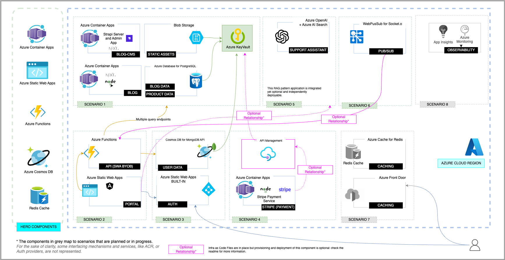

## Background Context

[**Contoso Corporation**](https://learn.microsoft.com/en-us/microsoft-365/enterprise/contoso-overview?view=o365-worldwide) is a fictitious multi-national organization with offices worldwide employing 30K+ workers. The company is now expanding to new regions, resulting in a massive hiring push which includes relocation assistance.

The Contoso HR team has designed requirements for a **Contoso Real Estate** application that can help _New Hires_ search for and reserve housing, while allowing _Admins_ the ability to approve and feature relevant properties on the site. The application is **meant for internal use only** and must be reliable, scalable and cost-effective.

## Prioritized Scenarios

Based on their discussions, the Contoso HR team has identified the following core scenarios:
1. _CMS and Blog_. | The Contoso HR Admin must be able to curate the properties available on site, and have the ability to write blog posts with relevant advice or recommendations for new hires.
2. 

## Reference Architecture 

The reference architecture envisions the 

## Development Environment
