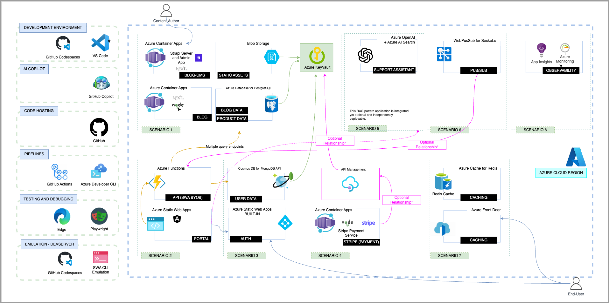

We'll showcase a number of developer tools and cloud service integrations based on Microsoft technologies. This section identifies key tools, accounts and resources you will need, to complete the walkthrough, with links to relevant quickstart guides.

## User Accounts

To complete this tutorial you will need:
 - An Azure account
 - A GitHub account
 - A Strapi account (for CMS integration)
 - A Stripe account (for Payments integration)
 - An Auth0 account (for Federated Authentication)

## Developer Tools

You should be able to complete this tutorial using any preferred text editor and terminal environment for local development. However, we recommend using Visual Studio Code for a simpler, streamlined developer experience.
 * [Get Started With Visual Studio Code](https://code.visualstudio.com/docs)

Visual Studio Code offers a number of powerful _Extensions_ that can improve developer productivity by default. We'll identify relevant extensions you can install for each scenario, as we develop them.
 * [Explore Visual Studio Code Marketplace](https://marketplace.visualstudio.com/VSCode)

An added benefit of using Visual Studio Code is the ability to work with _GitHub Codespaces_ to move seamlessly from your local environment to using VS Code in the browser (powered by a GitHub Cloud-hosted environment).
 * [Explore VS Code with GitHub Codespaces](https://code.visualstudio.com/docs/remote/codespaces)

## Command-Line Utilities

We also have a number of command-line tools (CLI) that can simplify your local development experience. We'll identify these in relevant scenarios, as we build. For now, here's a list of tools for reference:
 - Azure Developer CLI
 - Azure Static Web Apps CLI
 - Azure Core Functions Tools
 - Playwright Test