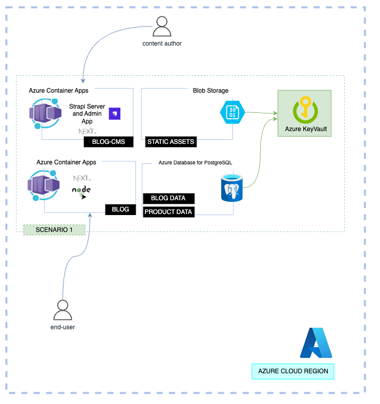

## 1. Architecture

This is the most important scenario of the application, providing data authoring and storing capabilities for both vertical micro-frontend applications, that compose it. We enable this capabilities, via the implementation of a Headless CMS, powered by Strapi.

There are two components that make up the architecture of this solution:

- A Headless CMS, implmented using Strapi.
- A frontend application, implemented using Next.js, that consumes the data from the Headless CMS and renders the blog pages.
- A PostegreSQL database that will store the data for the Headless CMS. The CMS will be hosted in Azure Container Apps, and the database will be hosted in Azure Database for PostgreSQL. They will connect to each other via the endpoints built-in the Strapi server implementation.

Both of these applications are hosted in [Azure Container Apps](https://learn.microsoft.com/azure/container-apps/overview).

## 2. Components

### 2.1 Headless CMS

The Headless CMS is a Strapi application that is hosted in Azure Container Apps and uses Azure Data for PostgreSQL as its database.

To store the media assets, Azure Blob Storage is used, via the [Strapi Azure Storage plugin](https://github.com/jakeFeldman/strapi-provider-upload-azure-storage).

### 2.2 Frontend Application

The frontend application is a Next.js application that is hosted in Azure Container Apps. The frontend application is stateless in the data that it accesses, instead it relies on the Headless CMS to provide the data that it needs to render the pages. This data is fetched by making API calls to the Headless CMS.
