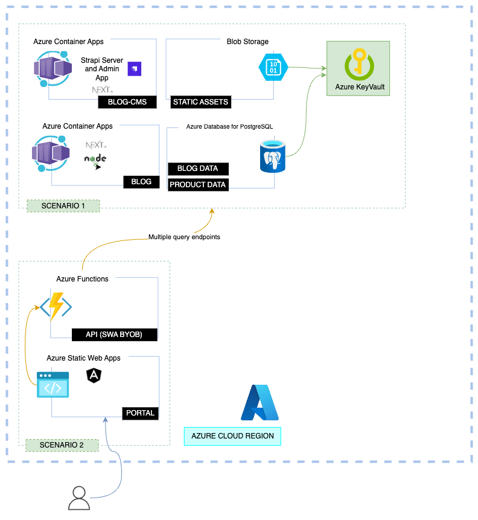

This scenario represents the implementation of a `Real Estate Portal App`, with multiple components, as part of a composable architecture. The following diagram shows the architecture of the solution.

## 1. Architecture

## 2. Components

### 2.1 Frontend Application

A frontend application we will call 'the Portal', which will be the main entry point for the users, implementing Angular as a JavaScript framework. This service is deployed to [Azure Static Web Apps](https://azure.microsoft.com/es-es/products/app-service/static/#features), including capabilities like 
  - Authentication and Authorization with Easy Auth

### 2.2 Backend Application

A function application with multiple endpoints, as application API. This service is deployed to [Azure Functions](https://azure.microsoft.com/services/functions/), which is a serverless compute service that allows you to run code on-demand without having to explicitly provision or manage infrastructure.

### 2.3 Backend Databases

The first database, which will be used to store the data for the application, in this case [Azure Database for PostgreSQL](https://azure.microsoft.com/services/postgresql/). Please notice that this database is populated from a headless CMS implementation, described in [scenario 3](/develop/scenario-3).

A second database, which will be used to store user events and user profiles. This service is deployed to [Azure Cosmos DB](https://azure.microsoft.com/services/cosmos-db/), which is a fully managed NoSQL database service that offers multiple APIs, including the Mongodb API.

