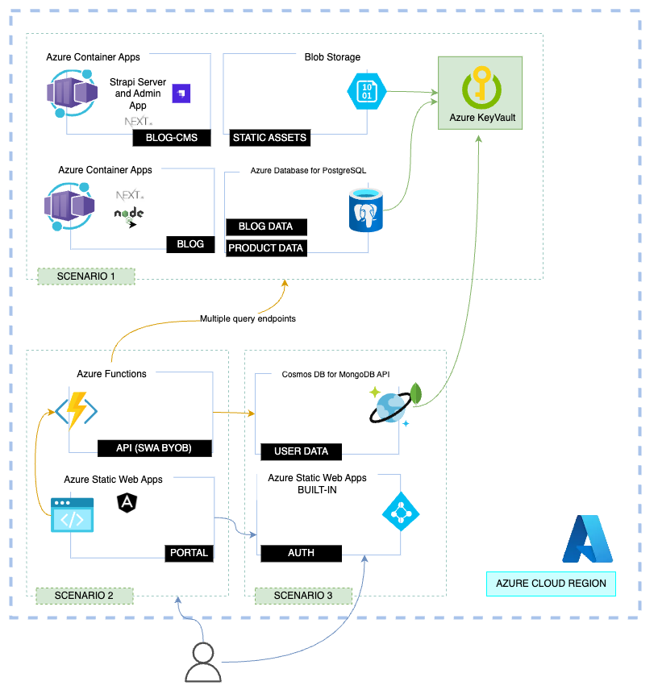

## 1. Architecture

There are several components that make up the architecture of this solution:

- The Static Web Apps frontend application
- The Static Web Apps in-built authentication mechanism

The frontend application is hosted in [Azure Static Web Apps](https://learn.microsoft.com/azure/static-web-apps/).

## 2. Authentication

### 2.1 Authentication Flow

To understand how the authentication flow works, we need to understand how the Static Web Apps in-built authentication mechanism works.

The user requests a page from the frontend application. The frontend application is hosted in Azure Static Web Apps, and the Static Web Apps in-built authentication mechanism is enabled for the application.

The Static Web Apps in-built authentication mechanism intercepts the request and checks if the user is authenticated. If the user is not authenticated, the Static Web Apps in-built authentication mechanism redirects the user to the authentication provider. The user is then redirected back to the frontend application, and the Static Web Apps in-built authentication mechanism intercepts the request again. This time, the user is authenticated, and the Static Web Apps in-built authentication mechanism allows the request to proceed.

The frontend application, developed with Angular, handles the flow by redirecting the user to a specific route, once the user has the respective cookie, with the necessary claims.

Here is a diagram that illustrates the authentication flow in more details:

However, in the local development environment, the Static Web Apps in-built authentication mechanism is not available. Instead, the Azure Static Web Apps CLI is used to emulate the authentication flow. The Azure Static Web Apps CLI is a command-line interface that enables you to develop and test your Azure Static Web Apps locally. Read more about [Developing locally with the Azure Static Web Apps CLI](https://docs.microsoft.com/azure/static-web-apps/local-development).

### 2.2 Supported Identity Providers

The Static Web Apps in-built authentication mechanism is enabled for the application. The following identity providers are available by default:

| Identity Provider | Sign-in endpoint | How-To guidance |
| --- | --- | --- |
| Microsoft Identity Platform | `/.auth/login/aad` | [App Service Microsoft Identity Platform login](https://docs.microsoft.com/azure/static-web-apps/authentication-authorization#app-service-microsoft-identity-platform-login) |
| Facebook | `/.auth/login/facebook` | [App Service Facebook login](https://docs.microsoft.com/azure/static-web-apps/authentication-authorization#app-service-facebook-login) |
| Google | `/.auth/login/google` | [App Service Google login](https://docs.microsoft.com/azure/static-web-apps/authentication-authorization#app-service-google-login) |
| GitHub | `/.auth/login/github` | [App Service GitHub login](https://docs.microsoft.com/azure/static-web-apps/authentication-authorization#app-service-github-login) |
| Sign in with Apple | `/.auth/login/apple` | [App Service Sign in With Apple login (Preview)](https://docs.microsoft.com/azure/static-web-apps/authentication-authorization#app-service-sign-in-with-apple-login-preview) |

In addition to the default identity providers, any OpenID Connect provider can be used. Read more about [App Service OpenID Connect login](https://learn.microsoft.com/azure/static-web-apps/authentication-custom?tabs=aad%2Cinvitations).
