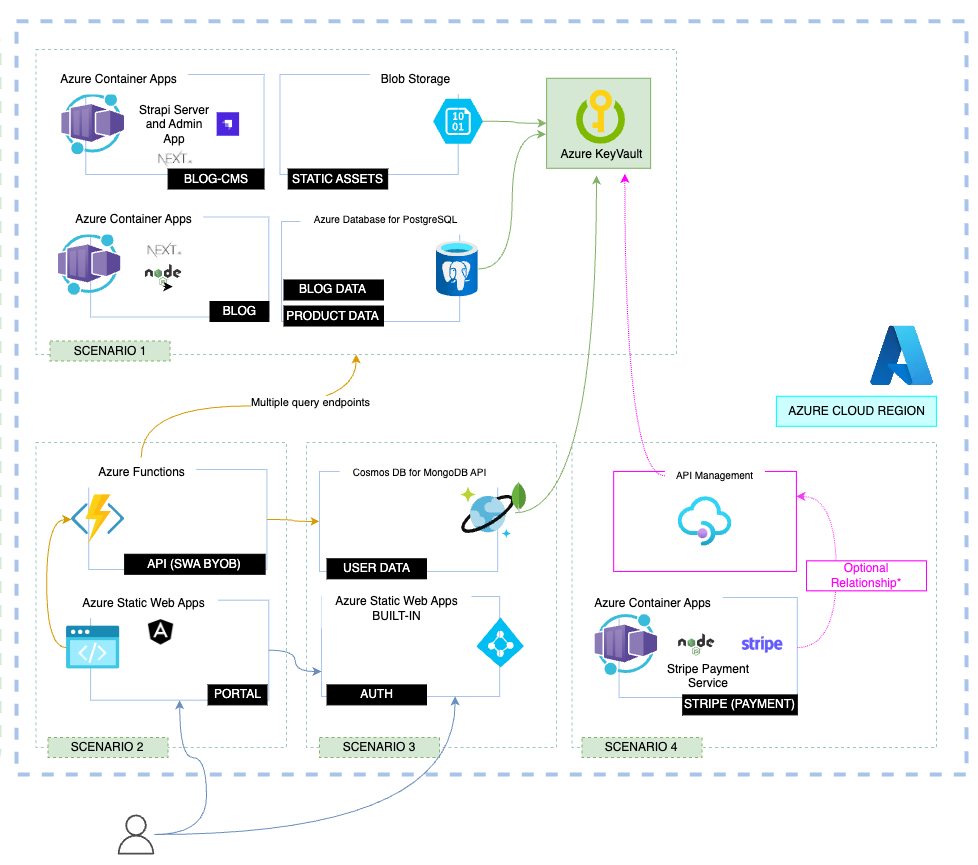

This scenario illustrates how to develop and containerize a payments application to be deployed to [Azure Container Apps](https://learn.microsoft.com/azure/container-apps/overview)

## 1. Architecture

## 2. Components

### 2.1. Frontend Application

The frontend application, in this case the portal, needs to be slightly modified to support the payments (reservation) flow. 

Each property will have a button to make a reservation, which will redirect the user to the payment flow. The payment flow will be implemented using [Stripe](https://stripe.com/), which is a payment processing platform that allows you to accept payments online.

### 2.2 Stripe Integration

In order to complete the integration, we will use the same Azure Functions application. We will set up an Azure Function to receive Stripe webhook events by defining a webhook endpoint URL and registering it with Stripe. 

When API Management receives a request for the webhook endpoint URL, it will forward the request to the Azure Function. The Azure Function will then handle the incoming webhook event and perform the desired actions in response to it. For that we will need to configure the Azure Function app to use the Stripe API by providing our Stripe API keys and other necessary credentials as environment variables. Please notice that when using Azure Developer CLI template, all those variables are already configured, except for the Stripe API keys.

The Azure Function code is written to handle the incoming webhook events and perform the desired actions in response to them, such as creating a new order, charging a payment method, or updating an order. Those actions are performed by calling the Stripe API and saved to the database, to be used by the frontend application, as described in the previous section.

