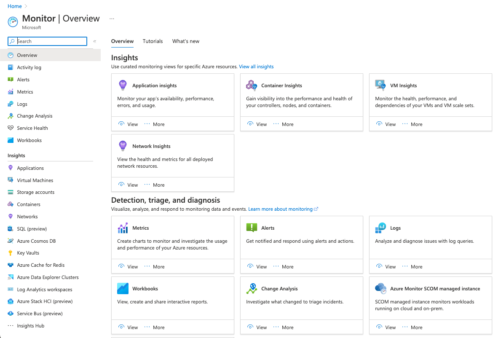

:::info CONTENT DELIVERABLES

- **Summary**: How to implement Azure Monitor, use Azure Monitoring Panel
- **Description**: This piece of content should be specially crafted for JavaScript developers, and tone and characteristics of content should target this audience
- **Dependencies**: Scenario 1
- **Service**: App Monitor
- **Type of Content**: Procedural
  :::

## 1. What is Azure Monitor?

[By definition](https://learn.microsoft.com/en-us/azure/azure-monitor/overview), Azure Monitor helps you **maximize the availability and performance of your applications and services**. It delivers a comprehensive solution for collecting, analyzing, and acting on telemetry from your cloud and on-premises environments. This information helps you understand how your applications are performing and proactively identify issues that affect them and the resources they depend on.

:::tip EXERCISE
Visit the Azure Portal, click on the hamburger menu, and select the **Monitor** option. You should see the Azure Monitoring Blade shown here. Explore the various panels and options.
:::

## 2. How do I activate it?

Azure Monitor is [available the moment you create an Azure subscription](https://learn.microsoft.com/en-us/azure/azure-monitor/getting-started). The Activity log immediately starts collecting events about activity in the subscription, and platform metrics are collected for any Azure resources you created. Features such as metrics explorer are available to analyze data. Other features require configuration. Similarly, as soon as you create an Azure resource, Azure Monitor is enabled and **starts collecting metrics and activity logs**.

- **Metrics data** can be explored at any time using the [Metrics Explorer](https://learn.microsoft.com/en-us/azure/azure-monitor/essentials/metrics-charts) in the Azure Portal.
  

- **Log data** can be analyzed with queries using the [Log Analytics](https://learn.microsoft.com/en-us/azure/azure-monitor/logs/log-query-overview) UI in the Azure portal.
  

:::tip EXERCISE
To get hands-on experience with the Azure Monitor, start by monitoring **a single resource** [using this tutorial](https://learn.microsoft.com/en-us/azure/azure-monitor/essentials/monitor-azure-resource) as a guide. Learn how Azure Monitor is activated by each type of service, what types of data are collected, and how data is analyzed and visualized in tools like Metrics Explorer and Log Analytics.
:::

## 3. How do I use it effectively?

Using Azure Monitor effectively requires 2 key steps:

- Configure the Azure Monitor components (to _collect and analyze data_ from targeted resources)
- Configure the targeted Azure resources (to _generate_ desired data for analysis)

From a [developer workflow](https://learn.microsoft.com/en-us/azure/azure-monitor/getting-started#getting-started-workflow) perspective, there are 5 main steps:

1.  [Planning](https://learn.microsoft.com/en-us/azure/azure-monitor/best-practices-plan) - define your requirements.
2.  [Configure](https://learn.microsoft.com/en-us/azure/azure-monitor/best-practices-data-collection) - resources for data collection.
3.  [Analyze](https://learn.microsoft.com/en-us/azure/azure-monitor/best-practices-analysis) - monitored data with queries, visualizations
4.  [Alert](https://learn.microsoft.com/en-us/azure/azure-monitor/best-practices-alerts) - with automated responses or notifications on key events
5.  [Optimize](https://learn.microsoft.com/en-us/azure/azure-monitor/best-practices-alerts) - costs for Azure monitor usage by iterative evaluation

:::tip EXERCISE
Walk through [these 7 modules](https://learn.microsoft.com/en-us/training/paths/monitor-usage-performance-availability-resources-azure-monitor) to get experience with:

- Setting up and configuring Azure Monitor
- Full-stack monitoring with App Insights
- Azure VM health monitoring with Metrics Explorer
- Page Load Times for web apps with App Insights
- Log Queries using Kusto Query Language
- Analyze Azure infra with Azure Monitor logs
- Improve incident response with Azure Monitor alerts
  :::

## 4. Azure Monitor In Action!

:::warning TODO
Walk through logs, metrics, app insights for the deployed E2E app. Identify ways to monitor for:

- app performance
- resource utilization
- cost optimization
  :::
