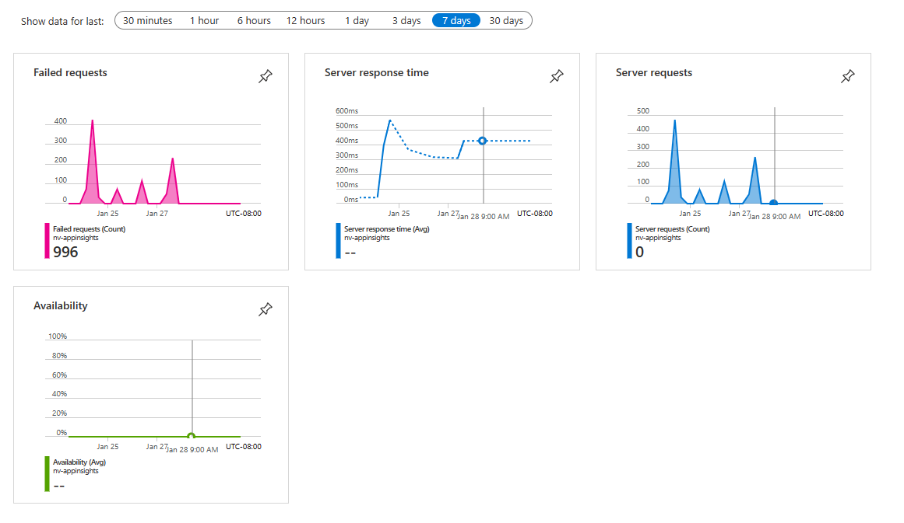
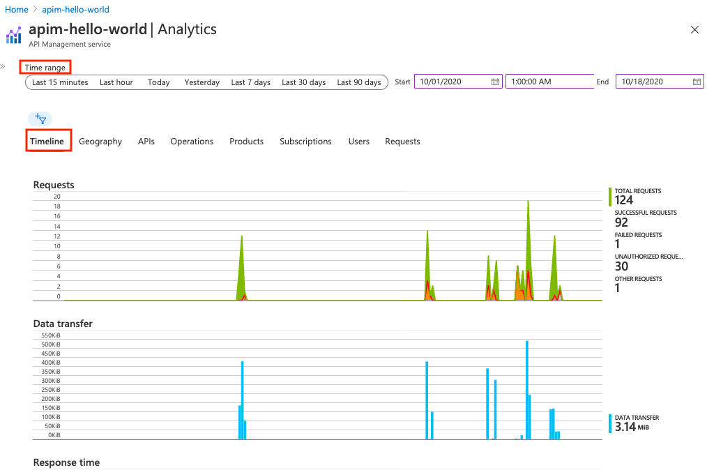
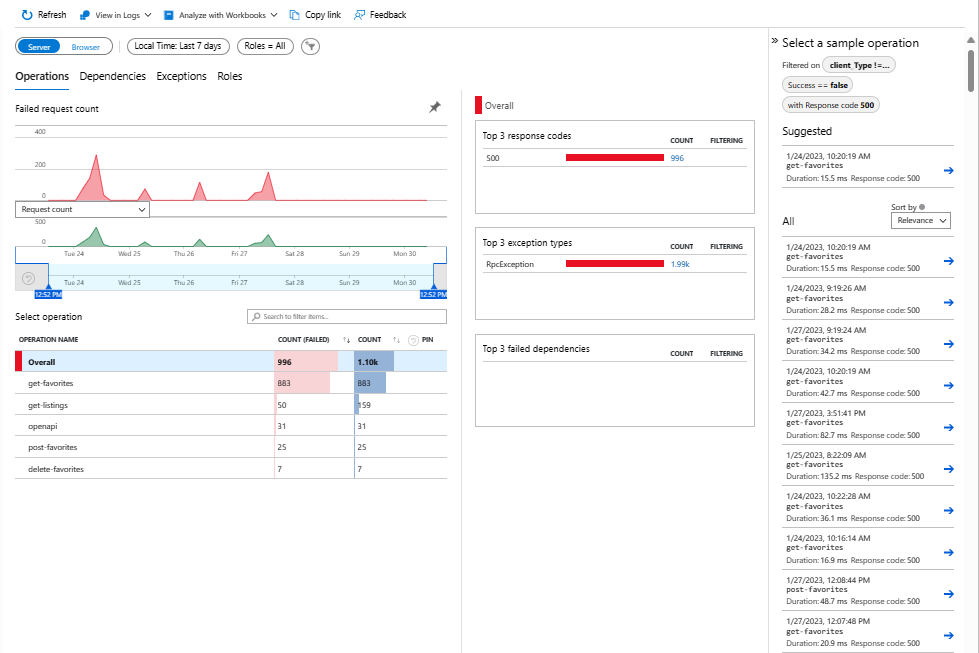
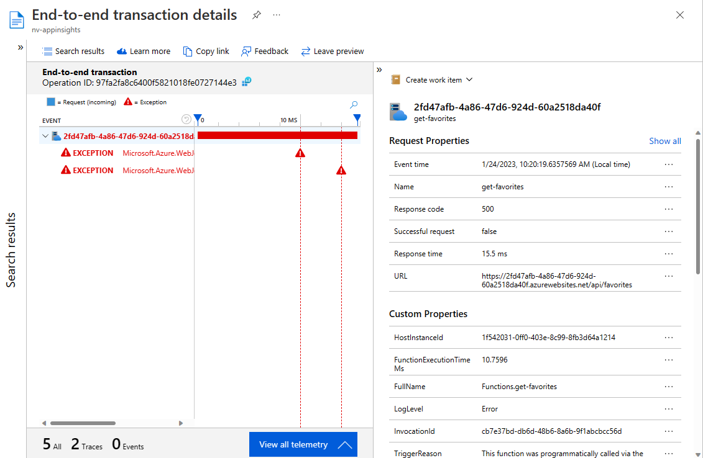
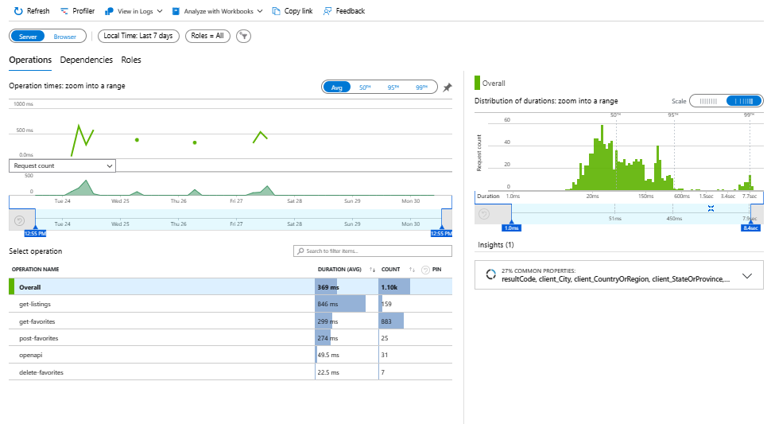

:::info CONTENT DELIVERABLES
 * **Summary**: Implementing analytics queries with AppInsights
 * **Description**: How to best leverage AppInsights for perf analysis
 * **Dependencies**: Scenario 1
 * **Service**: App Insights
 * **Type of Content**: Procedural

:::

## Application Insights

Application Insights is an [extension of Azure Monitor](insights#azure-monitor) and provides Application Performance Monitoring (also known as “APM”) features. APM tools are useful to monitor applications from development, through test, and into production.

### Enable insights

* [Auto-Instrumentation](https://github.com/Azure-Samples/contoso-real-estate) (agent): The easiest way to get started consuming Application insights is through the Azure portal and the built-in visual experiences.  Auto-Instrumentation is the only way to instrument an application in which you don't have access to the source code.
* Adding the [Application Insights SDK](https://learn.microsoft.com/en-us/azure/azure-monitor/app/app-insights-overview?tabs=net#supported-languages) to your application code. You only need to install the Application Insights SDK in the following circumstances:
    * You require custom events and metrics
    * You require control over the flow of telemetry
    * Auto-Instrumentation isn't available (typically due to language or platform limitations)
    
Advanced users can [query the underlying data](https://learn.microsoft.com/azure/azure-monitor/logs/log-query-overview) directly to [build custom visualizations](https://learn.microsoft.com/azure/azure-monitor/app/tutorial-app-dashboards) through Azure Monitor [Dashboards](https://learn.microsoft.com/azure/azure-monitor/app/overview-dashboard) and [Workbooks](https://learn.microsoft.com/azure/azure-monitor/visualize/workbooks-overview).

### Scenario 1 insights

The portal app featured in Scenario 1 consists of several Azure services:

* Azure Static web apps:
    * Auto-instrumentation requires an application with an [API](https://learn.microsoft.com/en-us/azure/static-web-apps/add-api?tabs=vanilla-javascript). 
* Azure API management: 
    * [Auto-instrumentation](https://learn.microsoft.com/en-us/azure/api-management/howto-use-analytics) including [published APIs](https://learn.microsoft.com/en-us/azure/api-management/api-management-howto-use-azure-monitor).
* Azure Database for PostgreSQL flexible server:
    * Does not provide auto-instrumentation

## Insights deep dive

### Azure Static Web Apps

Application insights provides auto-instrumented insights when the Static Web App includes an API. The API can be managed or an external Functions App.

The most common insights available over a several time ranges for both browser and server include:

* Failed requests for API request failures include the date and time, URL, response code, response time
* Server request and response shows the API request performance over time and the count by route
* Server requests shows the count by route
* Availability allows you to configure tests such as PING tests or multi-step for your resource

### Azure API Management

Azure API Management provides [auto-instrumented insights](https://learn.microsoft.com/en-us/azure/api-management/howto-use-analytics) for your APIs. Analyze the usage and performance of the APIs in your API Management instance across several dimensions, including:

* Time
* Geography
* APIs
* API operations
* Products
* Subscriptions
* Users
* Requests

API Management emits [metrics](https://learn.microsoft.com/en-us/azure/azure-monitor/essentials/data-platform-metrics) every minute, giving you near real-time visibility into the state and health of your APIs. The following are the two most frequently used metrics. For a list of all available metrics, see [supported metrics](https://learn.microsoft.com/en-us/azure/azure-monitor/essentials/metrics-supported#microsoftapimanagementservice).

* Capacity - helps you make decisions about upgrading/downgrading your API Management services. The metric is emitted per minute and reflects the estimated gateway capacity at the time of reporting. The metric ranges from 0-100 calculated based on gateway resources such as CPU and memory utilization.
* Requests - helps you analyze API traffic going through your API Management services. The metric is emitted per minute and reports the number of gateway requests with dimensions. Filter requests by response codes, location, hostname, and errors.

## Turn on insights 

Insights are enabled at the resource group or resource level, during resource creation or after resource creation is complete.

Insights are provided by a separate resource, Azure [Application Insights](https://learn.microsoft.com/en-us/azure/azure-monitor/app/app-insights-overview?tabs=nodejs). 

### During creation

* Anytime: The [Azure portal](https://portal.azure.com/)is the simpliest way to enable insights is in the Azure portal.
* Configuration: Configure insights from the configuration tools such as [Azure CLI](https://learn.microsoft.com/en-us/cli/azure/) or [PowerShell](https://learn.microsoft.com/en-us/powershell/azure/?view=azps-9.3.0). Each Azure resource which supports Application Insights has its own command to enable and disable insights.
* Deployment: Enable insights from a deployment tool such as [Bicep](https://learn.microsoft.com/en-us/azure/azure-resource-manager/bicep/) or [Azure Dev CLI](https://learn.microsoft.com/en-us/azure/developer/azure-developer-cli/overview).

### After creation

After your resource is created, you can turn on insights with:

* Anytime: The [Azure portal](https://portal.azure.com/)is the simpliest way to enable insights is in the Azure portal.
* Configuration: Configure insights from the configuration tools such as [Azure CLI](https://learn.microsoft.com/en-us/cli/azure/) or [PowerShell](https://learn.microsoft.com/en-us/powershell/azure/?view=azps-9.3.0). Each Azure resource which supports Application Insights has its own command to enable and disable insights.

## Cost for activation

Insights are provided with consumption-based pricing, which is also known as pay-as-you-go pricing. With this billing model, you only pay for what you use. Features of Azure Monitor that are enabled by default don't incur any charge.

Learn more about the [pricing model](https://learn.microsoft.com/en-us/azure/azure-monitor/usage-estimated-costs#pricing-model). 

### Standard insights

[Standard insights](https://learn.microsoft.com/en-us/azure/azure-monitor/app/standard-metrics) are provided when the resource is created and provide a graduated pricing tier. 

### Custom insights

Custom insights are provided by integrating the [Application Insights SDK](https://learn.microsoft.com/en-us/azure/azure-monitor/app/app-insights-overview?tabs=net#supported-languages) to your source code to provide custom instrumentation. You can reduce the cost of your insights by reducing the [ingestion sampling](https://learn.microsoft.com/en-us/azure/azure-monitor/app/sampling#ingestion-sampling) rate. 

[Custom insights include](https://learn.microsoft.com/en-us/azure/azure-monitor/app/api-custom-events-metrics#api-summary) tracking the following

* [Page views](https://learn.microsoft.com/en-us/azure/azure-monitor/app/api-custom-events-metrics#page-views)
* [Events](https://learn.microsoft.com/en-us/azure/azure-monitor/app/api-custom-events-metrics#trackevent)
* [Metrics](https://learn.microsoft.com/en-us/azure/azure-monitor/app/api-custom-events-metrics#getmetric)
* [Exceptions](https://learn.microsoft.com/en-us/azure/azure-monitor/app/api-custom-events-metrics#trackexception)
* [Requests](https://learn.microsoft.com/en-us/azure/azure-monitor/app/api-custom-events-metrics#trackrequest)
* [Trace](https://learn.microsoft.com/en-us/azure/azure-monitor/app/api-custom-events-metrics#tracktrace) 
* [Dependencies](https://learn.microsoft.com/en-us/azure/azure-monitor/app/api-custom-events-metrics#trackdependency)

You can attach [properties and metrics](https://learn.microsoft.com/en-us/azure/azure-monitor/app/api-custom-events-metrics#properties) to most of these telemetry calls.

### Managing cost

When considering cost for Application Insights, consider [configuring the following design optimizations](https://learn.microsoft.com/en-us/azure/azure-monitor/app/javascript?tabs=snippet#configuration):
 
* Use [sampling](https://learn.microsoft.com/en-us/azure/azure-monitor/app/sampling) to reduce the amount of data sent to Application Insights.
* Turn off unneeded [collection for web pages](https://learn.microsoft.com/en-us/azure/azure-monitor/app/javascript#configuration)
* Reduce HTTP request [tracing for web pages](https://learn.microsoft.com/en-us/azure/azure-monitor/app/javascript#configuration)

## Visualize insights

### Failures 

Deep dive into failures in a give time range

Select an item to see details of the failure

### Performance 

View request time and request count over a time range.

## Analyze

### Request and response failures

### Dependency failures

### Source code exceptions

### Current performance 

### Slowest resources

### Slowest dependencies

## Investigate a failure

## Investigate performance 